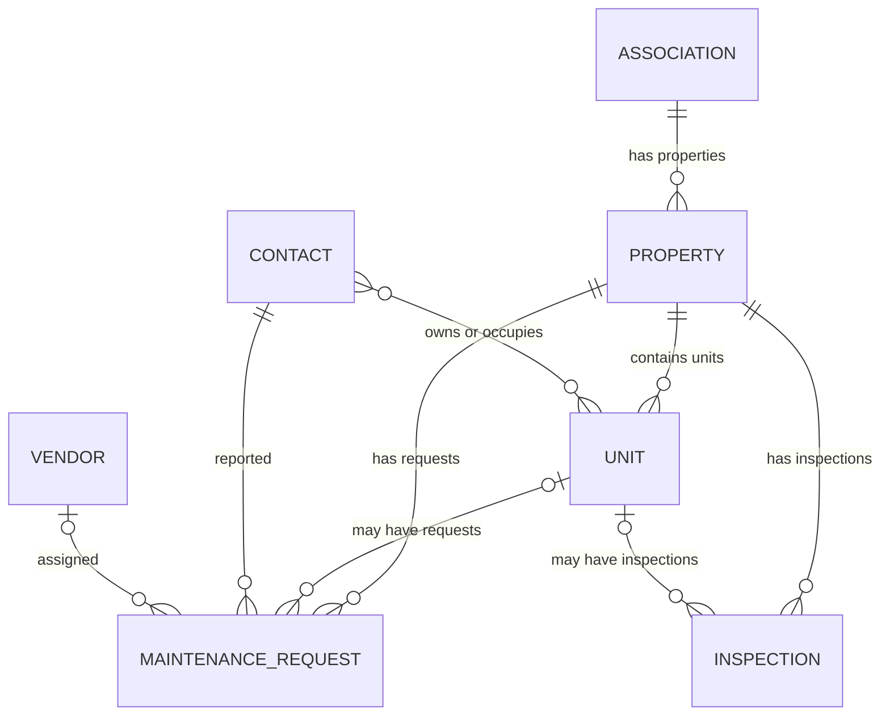
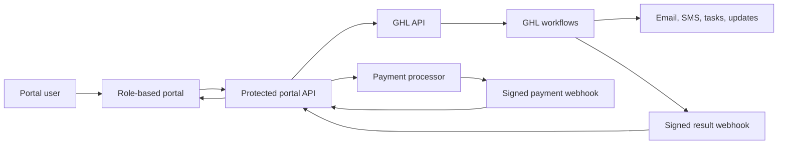
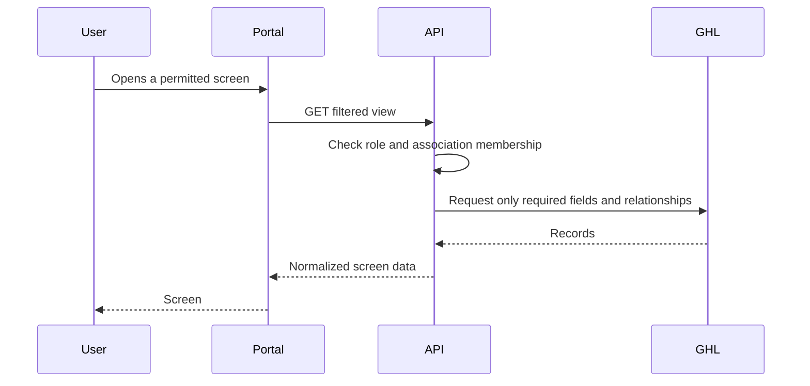
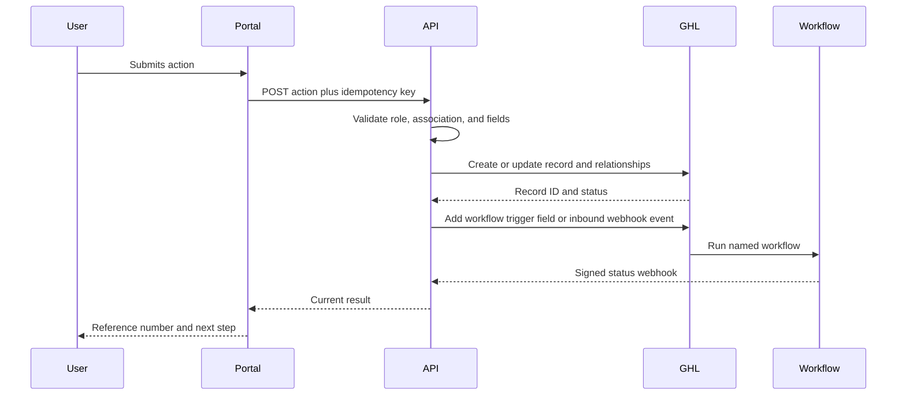
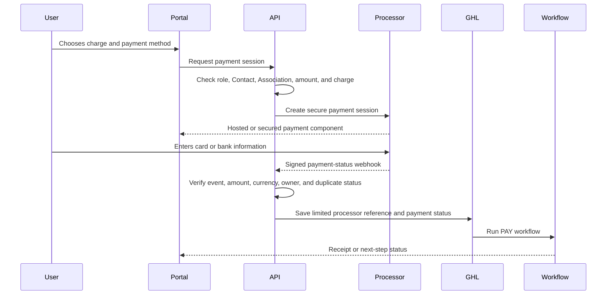
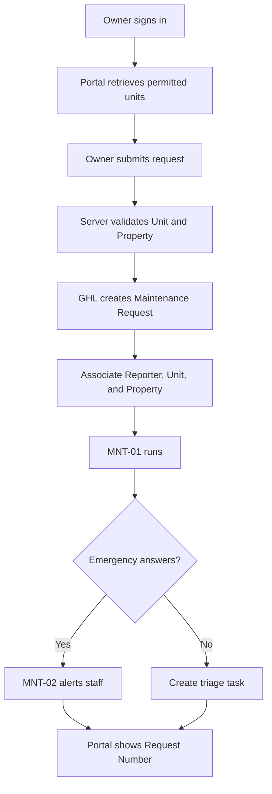
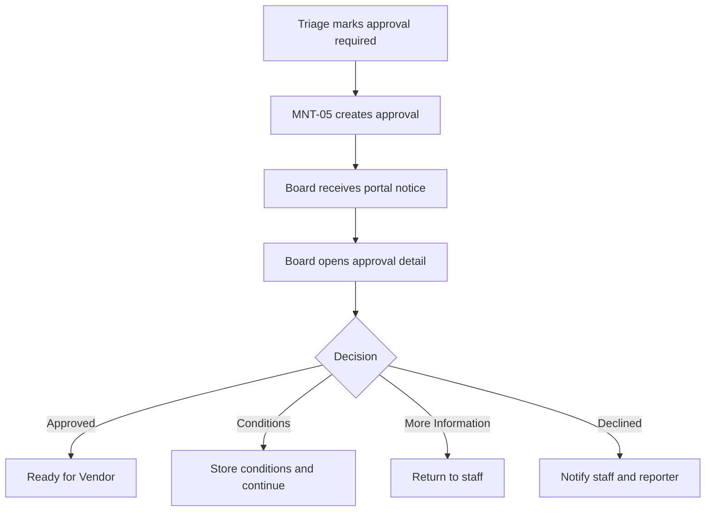
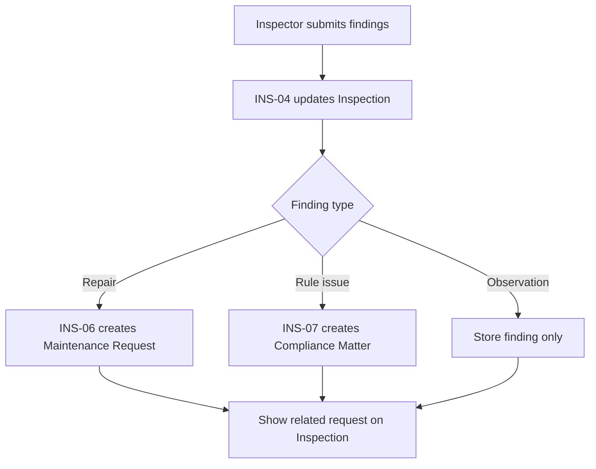
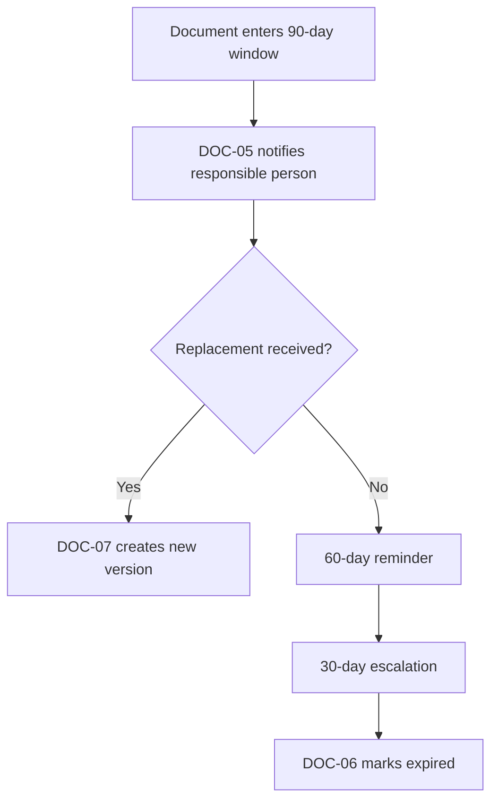
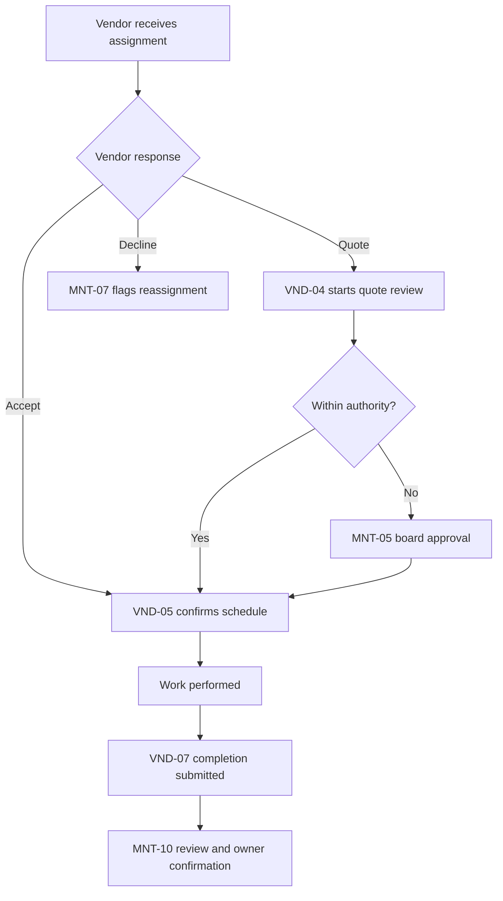

# Exemplary Property Management Portal

## Complete Four-Role Interface and GHL Integration Build Specification

Prepared for Exemplary Services LLC and True Products Network  
Version: 1.1  
Date: July 30, 2026  
Primary time zone: America/Chicago

---

## 1. Purpose of this document

This document is the build specification for a clean, modern property-management portal connected to GoHighLevel (GHL).

The portal is the interface people see and work in. GHL stores the operational records, runs workflows, sends messages, creates tasks, tracks status changes, and holds the approved object relationships. The portal exchanges small, focused payloads with GHL through a protected server-side API and signed webhooks.

This specification defines:

- the four role-based portal versions;
- every required screen;
- shared interface patterns;
- the GHL records shown on each screen;
- portal buttons and the processes they start;
- API and webhook behavior;
- portal-native form behavior;
- maintenance, inspection, document, compliance, vendor, approval, and communication workflows;
- user maintenance, administration, and GHL Contact Role mapping;
- payment-processor behavior and payment discovery decisions;
- permissions and association-level record separation;
- data validation, audit, error, loading, and empty states;
- test records and acceptance tests;
- a practical build sequence.

The finished portal must be usable without opening GHL for ordinary daily work.

### 1.1 Confirmed decisions in Version 1.1

1. Replace the named management user with the system role **Admin User**.
2. Add an **Admin** section to the Management Portal. Only an authenticated user with the `Admin User` portal role may see or use it.
3. Base portal login access on GHL Contact Role field values and approved record associations. GHL’s native staff roles remain separate.
4. All user-facing forms are designed and rendered inside the portal. Do not build the production forms as GHL forms, GHL surveys, funnel forms, or embedded GHL forms.
5. Every portal form submits to the protected portal API. The API writes the required GHL record and relationships, then starts the named GHL workflow through a record-change trigger or approved inbound webhook.
6. Payments are initiated and completed in the portal through a selected payment processor. Card and bank details pass directly to the processor and never enter GHL or the portal application database.
7. Inspection, Document Record, and Compliance Matter custom objects and record types already exist in GHL. Reuse them; do not recreate or rename them without written approval.

---

## 2. Builder instruction

Build the portal exactly from this specification unless a later written decision replaces part of it.

When a requirement is unclear:

1. Do not invent a new record relationship.
2. Do not duplicate data merely to make a screen easier.
3. Do not expose raw GHL IDs to end users.
4. Keep the latest approved relationship rule.
5. Record the question in a build-decision log.
6. Use test records until Nigel or the Admin User approves production data.

### Definition of done

A screen is complete only when it has:

- desktop, tablet, and mobile layouts;
- role and association permission checks;
- loading, empty, success, validation, and error states;
- working read and write connections;
- a recorded audit event for sensitive actions;
- tested workflow responses from GHL;
- keyboard access and visible focus states;
- meaningful labels for screen readers;
- no access to another association’s restricted records.

---

## 3. Approved visual direction

These two approved screens are the visual source for the complete portal.

### 3.1 Management dashboard


Reference behavior:

- dark navy left sidebar;
- teal active menu item;
- white and very light gray workspace;
- compact summary cards;
- clear status pills;
- data tables with a restrained amount of color;
- right-side activity and quick-action panels;
- GHL connection indicator at the bottom of the management menu.

### 3.2 Maintenance Request detail


Reference behavior:

- large record title and number;
- urgency and status shown beside the title;
- horizontal process tracker;
- summary cards for request, property, reporter, vendor, schedule, and cost;
- activity, messages, and files tabs;
- record-specific actions at the bottom;
- visible GHL activity markers;
- no direct Association field on the request.

### 3.3 Visual rules

| Item | Specification |
|---|---|
| Primary navy | `#062F52` |
| Secondary navy | `#0B3F69` |
| Teal | `#07838B` |
| Teal hover | `#066B72` |
| Gold accent | `#D6A52A` |
| Page background | `#F5F7FA` |
| Card background | `#FFFFFF` |
| Main text | `#17212B` |
| Secondary text | `#64748B` |
| Border | `#DCE3EA` |
| Success | `#2E9D55` |
| Warning | `#D88A10` |
| Error | `#C93C3C` |
| Information | `#2E78D2` |
| Main font | Inter, Aptos, or another clean sans-serif |
| Card radius | 10–12px |
| Button radius | 7–9px |
| Main shadow | subtle; no heavy floating effects |
| Desktop sidebar | 248–260px |
| Main content max width | 1600px |
| Desktop grid | 12 columns |

### 3.4 Status color rules

Color is a secondary cue. Every status must also have text.

| Status type | Color |
|---|---|
| New / information | Blue |
| Active / completed / approved | Green |
| Waiting / pending | Gold |
| Urgent / overdue / rejected | Red |
| Scheduled / in progress | Teal |
| Closed / inactive | Gray |
| Board review | Purple |

---

## 4. System boundary

### 4.1 Portal responsibilities

The portal handles:

- sign-in and role-based screens;
- searchable lists and detail pages;
- every user-facing form and field interaction;
- file selection and approved file transfer;
- user actions;
- filtered record retrieval;
- showing workflow progress;
- short-lived caching;
- portal session data;
- friendly error messages.

The portal must not render, iframe, or embed GHL forms or surveys. GHL remains the record and workflow system behind the portal, not the data-entry interface.

### 4.2 GHL responsibilities

GHL handles:

- Contacts;
- Association and Vendor Company records;
- Property, Unit, Maintenance Request, Inspection, Document Record, and Compliance Matter custom objects;
- object relationships;
- workflows;
- tasks and assignments;
- email, SMS, and portal-message actions;
- appointment and reminder actions;
- status changes;
- approval tracking;
- workflow activity returned to the portal.

GHL does not host the production portal forms. It receives validated portal submissions through the protected API or an approved inbound webhook and runs all business-process workflows.

### 4.3 Middleware responsibilities

A protected server-side integration layer handles:

- GHL authentication;
- role and association checks;
- mapping friendly portal routes to GHL record IDs;
- batching small read requests;
- creating and updating records;
- association creation;
- webhook signature checks;
- idempotency;
- retries;
- rate-limit handling;
- file transfer;
- redaction;
- integration logs;
- short-lived cache entries.

For payments, the middleware also:

- creates a processor checkout or payment session;
- verifies payment-processor webhooks;
- maps processor customer and transaction references to the correct Contact, Association, Property, Unit, invoice, assessment, or charge;
- writes a limited payment-status summary to GHL;
- starts the corresponding GHL payment workflow;
- never receives, logs, or stores raw card or bank details.

The browser must never contain a GHL private integration token.

### 4.4 Records that should remain outside GHL

The portal and GHL must not be treated as:

- the formal accounting ledger;
- the bank ledger;
- a store for raw card or bank credentials;
- a replacement for the payment processor;
- the final repository for highly restricted legal or financial files when a protected document store is available.

The selected payment processor is the source of truth for payment authorization and transaction status. The accounting platform remains the source of truth for the formal financial ledger unless later discovery approves another design. GHL stores only operational payment references and workflow status.

---

## 5. Current GHL record model

### 5.1 Record types

| Business record | GHL storage | Unique key | Build stage |
|---|---|---|---|
| Association | Company | Association ID | Current |
| Owner, co-owner, board member, occupant, staff, vendor contact | Contact | Contact ID | Current |
| Vendor | Company | Vendor ID | Current |
| Property | Custom Object | Property ID | Current |
| Unit | Custom Object | Unit ID | Current |
| Maintenance Request | Custom Object | Request Number | Current |
| Inspection | Custom Object | Inspection Number | Built — reuse existing |
| Document Record | Custom Object | Document ID | Built — reuse existing |
| Compliance Matter | Custom Object | Matter Number | Built — reuse existing |

Inspection, Document Record, and Compliance Matter fields, record types, option values, and internal IDs must be inventoried before interface mapping. The builder must extend the existing objects only when the specification requires a missing field and the change is approved.

### 5.2 Approved relationship model



### 5.3 Latest maintenance relationship rule

A Maintenance Request is related directly to:

- Property;
- Unit, when applicable;
- Reported By Contact;
- Assigned Vendor Company, when assigned;
- Assigned Staff Member.

It does **not** have a separate direct Association relationship.

The Association is obtained through:

`Maintenance Request → Property → Association`

This rule replaces any earlier workbook row or instruction that directly connected Maintenance Request to Association.

### 5.4 Document relationships

A Document Record may relate to one or more approved record types through distinct labels:

- Related Company;
- Related Property;
- Related Unit;
- Related Contact;
- Related Maintenance Request;
- Related Inspection;
- Related Compliance Matter.

The portal must show the relationship type and related record name.

---

## 6. Four portal versions

### 6.1 Version A — Management Portal

Users:

- Admin User;
- property managers;
- approved staff;
- maintenance coordinators;
- bookkeepers with restricted financial access;
- platform administrators assigned the `Admin User` role.

Purpose:

- operate the full portfolio;
- review and update records;
- start GHL processes;
- track exceptions and overdue work;
- communicate with owners, board members, and vendors;
- manage inspections, documents, and compliance.

The Management Portal contains ordinary operational screens plus a separate Admin section. Being a property manager or approved staff member does not grant Admin access.

### 6.2 Version B — Owner and Resident Portal

Users:

- property owners;
- co-owners;
- occupants;
- tenants when approved.

Purpose:

- view only connected properties and units;
- submit and follow maintenance requests;
- view notices, documents, inspection results, charges, payments, receipts, and statements permitted for their records;
- update permitted contact and unit information;
- reply to messages and confirm completed work.

### 6.3 Version C — Board Portal

Users:

- board president;
- treasurer;
- secretary;
- board members;
- approved committee members.

Purpose:

- view the assigned association;
- review approval requests;
- view maintenance, inspection, compliance, document, and report summaries;
- receive board notices;
- access meeting material;
- record decisions where allowed.

### 6.4 Version D — Vendor Portal

Users:

- approved vendor contacts;
- assigned contractors;
- inspectors where applicable.

Purpose:

- view assigned work only;
- accept, decline, or request more information;
- submit quotes;
- confirm appointments;
- record work progress;
- upload completion evidence and invoices;
- maintain approved vendor credentials.

---

## 7. Role-based menus

### 7.1 Management menu

1. Overview
2. Associations
3. Properties
4. Units
5. People
6. Maintenance
7. Vendors
8. Inspections
9. Documents
10. Compliance
11. Approvals
12. Payments
13. Communications
14. Reports
15. Workflow Activity
16. Admin — visible only to `Admin User`
17. Help

The Admin menu expands to:

1. Admin Home
2. User Maintenance
3. Roles and Permissions
4. GHL Contact Role Mapping
5. Workflow and Templates
6. Integrations
7. Payment Processor
8. System Lists
9. Audit Log

### 7.2 Owner and Resident menu

1. Home
2. My Property & Unit
3. Maintenance
4. Inspections
5. Documents
6. Notices
7. Payments
8. Messages
9. My Profile
10. Help

### 7.3 Board menu

1. Board Home
2. Association
3. Approvals
4. Maintenance
5. Inspections
6. Compliance
7. Documents
8. Meetings
9. Reports
10. Announcements
11. Board Directory
12. My Profile
13. Help

### 7.4 Vendor menu

1. Vendor Home
2. Assigned Jobs
3. Quotes
4. Schedule
5. Completed Work
6. Documents
7. Invoices
8. Messages
9. Company Profile
10. Help

---

## 8. Shared screen shell

Every authenticated page uses the same shell:

```text
┌─────────────────────────────────────────────────────────────────────┐
│ Search                    Notifications   Help   User / Role        │
├───────────────┬─────────────────────────────────────────────────────┤
│ Role menu     │ Breadcrumbs                                         │
│               │ Page title                         Main action       │
│               │ Filters / tabs / summary cards                       │
│               │                                                     │
│               │ Main page content                                   │
│               │                                                     │
│ Connection    │                                                     │
│ status        │                                                     │
└───────────────┴─────────────────────────────────────────────────────┘
```

### Shared components

- Association switcher for authorized management users.
- Property switcher when the user has more than one permitted property.
- Global search, limited by role and association.
- Notification drawer.
- Help and emergency information.
- User menu.
- Breadcrumbs.
- Record title and ID.
- Status and urgency pills.
- Filter drawer on mobile.
- Activity timeline.
- Messages tab.
- Files tab.
- Related-record cards.
- Confirmation modal for sensitive actions.
- Workflow result panel.

---

## 9. Complete screen inventory

The following list is the required first full portal. “Shared” means the underlying component can be reused, but the data and actions must follow the active role.

Current inventory: 114 screens — 10 shared access screens, 56 Management screens including the Admin-only area, 17 Owner/Resident screens, 18 Board screens, and 13 Vendor screens.

### 9.1 Shared access screens

| ID | Screen | Roles | Main purpose |
|---|---|---|---|
| SH-01 | Sign In | All | Secure portal access |
| SH-02 | Forgot / Reset Password | All | Password recovery |
| SH-03 | Multi-Factor Verification | Staff, board, approvers | Verify a second factor |
| SH-04 | Invitation Acceptance | All | Confirm account and role |
| SH-05 | Role / Association Selector | Multi-role users | Choose current working context |
| SH-06 | Notification Center | All | View portal and workflow notices |
| SH-07 | User Profile | All | Update permitted personal settings |
| SH-08 | Help and Emergency Information | All | Support and emergency instructions |
| SH-09 | Access Denied | All | Explain restricted access without exposing records |
| SH-10 | System Status | Admin User | Connection and workflow health |

### 9.2 Management screens

| ID | Screen |
|---|---|
| MG-01 | Portfolio Overview |
| MG-02 | Association List |
| MG-03 | Association Detail |
| MG-04 | Association Create / Edit |
| MG-05 | Association Onboarding Checklist |
| MG-06 | Property List |
| MG-07 | Property Detail |
| MG-08 | Property Create / Edit |
| MG-09 | Unit List |
| MG-10 | Unit Detail |
| MG-11 | Unit Create / Edit |
| MG-12 | People Directory |
| MG-13 | Contact Detail |
| MG-14 | Contact Create / Edit |
| MG-15 | Relationship Manager |
| MG-16 | Maintenance Queue |
| MG-17 | Maintenance Request Detail |
| MG-18 | New Maintenance Request |
| MG-19 | Maintenance Triage |
| MG-20 | Vendor Assignment / Quote Review |
| MG-21 | Maintenance Completion Review |
| MG-22 | Vendor List |
| MG-23 | Vendor Detail |
| MG-24 | Vendor Create / Edit |
| MG-25 | Vendor Credential Review |
| MG-26 | Inspection Queue / Calendar |
| MG-27 | Inspection Detail |
| MG-28 | New / Schedule Inspection |
| MG-29 | Inspection Checklist / Findings |
| MG-30 | Inspection Follow-Up |
| MG-31 | Document Library |
| MG-32 | Document Detail |
| MG-33 | Add / Issue Document |
| MG-34 | Document Expiration and Acknowledgment Queue |
| MG-35 | Compliance Queue |
| MG-36 | Compliance Matter Detail |
| MG-37 | New Compliance Matter |
| MG-38 | Notice / Hearing / Resolution |
| MG-39 | Approval Inbox |
| MG-40 | Approval Detail |
| MG-41 | Payment and Financial Handoff Summary |
| MG-42 | Communications Inbox |
| MG-43 | Announcement Composer |
| MG-44 | Communication Detail |
| MG-45 | Reports Home |
| MG-46 | Report Detail / Export |
| MG-47 | Workflow Activity |
| MG-48 | Integration Error Queue |
| MG-49 | Admin Home |
| MG-50 | Roles and Permissions |
| MG-51 | Workflow and Template Settings |
| MG-52 | Integration Settings |
| MG-53 | Dropdown and Category Settings |
| MG-54 | Audit Log |
| MG-55 | User Maintenance |
| MG-56 | GHL Contact Role Mapping |

MG-49 through MG-56 are Admin-only screens. They must not appear in navigation, search, route metadata, page preload data, or API responses for any user who does not hold the active `Admin User` role.

### 9.3 Owner and Resident screens

| ID | Screen |
|---|---|
| OR-01 | Owner / Resident Home |
| OR-02 | My Property and Unit |
| OR-03 | Household / Occupancy Information |
| OR-04 | My Maintenance Requests |
| OR-05 | Submit Maintenance Request |
| OR-06 | Maintenance Request Detail |
| OR-07 | Owner Completion Confirmation |
| OR-08 | My Inspections |
| OR-09 | Inspection Result Detail |
| OR-10 | My Documents |
| OR-11 | Document View / Acknowledgment |
| OR-12 | Notices and Compliance |
| OR-13 | Notice Response |
| OR-14 | Payments and Statements |
| OR-15 | Messages |
| OR-16 | Message Detail |
| OR-17 | Contact Preferences and Consent |

### 9.4 Board screens

| ID | Screen |
|---|---|
| BD-01 | Board Home |
| BD-02 | Association Summary |
| BD-03 | Approval Queue |
| BD-04 | Approval Detail / Decision |
| BD-05 | Maintenance Overview |
| BD-06 | Maintenance Detail |
| BD-07 | Inspection Overview |
| BD-08 | Inspection Detail |
| BD-09 | Compliance Overview |
| BD-10 | Compliance / Hearing Detail |
| BD-11 | Board Documents |
| BD-12 | Document View / Vote / Acknowledgment |
| BD-13 | Meetings List / Calendar |
| BD-14 | Meeting Detail and Packet |
| BD-15 | Reports Home |
| BD-16 | Report Detail |
| BD-17 | Announcement Review / Send |
| BD-18 | Board Directory |

### 9.5 Vendor screens

| ID | Screen |
|---|---|
| VN-01 | Vendor Home |
| VN-02 | Assigned Jobs |
| VN-03 | Job Detail |
| VN-04 | Accept / Decline / Request Information |
| VN-05 | Quote Submission |
| VN-06 | Schedule Confirmation |
| VN-07 | Work Progress Update |
| VN-08 | Work Completion Form |
| VN-09 | Completed Work History |
| VN-10 | Invoice Submission |
| VN-11 | Vendor Documents |
| VN-12 | Company Profile and Credentials |
| VN-13 | Vendor Messages |

---

## 10. Screen blueprints — shared access

### SH-01 — Sign In

Visible:

- Exemplary logo;
- email address;
- password;
- “Remember this device” checkbox;
- sign-in button;
- password-reset link;
- invitation help;
- support link;
- privacy and terms links.

Behavior:

- after authentication, resolve the authenticated identity to its GHL Contact or approved internal staff identity;
- retrieve GHL `Contact Role(s)`, `Portal Access Status`, and permitted Association, Property, Unit, Vendor, and staff relationships;
- deny access when the Contact is inactive, suspended, revoked, unmatched, or has no permitted portal role;
- if the user has one role and one association, open that home page;
- if the user has several roles or associations, open SH-05;
- show the Admin option only when GHL `Contact Role(s)` includes `Admin User`;
- never reveal whether an unknown email belongs to another association.

### SH-02 — Forgot / Reset Password

Visible:

- email address;
- send reset link;
- return to sign in;
- confirmation that does not disclose whether the account exists;
- expired-link and already-used-link states;
- support link.

### SH-03 — Multi-Factor Verification

Visible:

- verification method;
- six-digit code;
- resend timer;
- trusted-device choice when permitted;
- recovery-code option;
- support path for a lost device.

Require this screen for staff, board members, and users making approval decisions.

### SH-04 — Invitation Acceptance

Visible:

- invited email;
- inviting organization;
- proposed role and Association;
- name confirmation;
- password creation or identity-provider action;
- terms and privacy acknowledgment;
- accept invitation.

The server verifies that the invitation is active, unused, and matches the signed-in email before adding membership. Acceptance updates the approved GHL Contact Role field, invitation status, portal identity reference, and related access records through the protected API.

### SH-05 — Role / Association Selector

Cards show:

- role;
- association name;
- property count or related unit;
- last accessed date;
- “Continue” button.

Example:

```text
Mary Jones
├── Owner — Ridgeland Condominium Association — Unit 3S
└── Board Member — Ridgeland Condominium Association
```

### SH-06 — Notification Center

Tabs:

- All;
- Action Required;
- Messages;
- Status Updates;
- Completed.

Each row shows:

- icon;
- title;
- related record;
- timestamp;
- unread marker;
- action;
- workflow source when relevant.

### SH-07 — User Profile

Sections:

- name and contact information;
- preferred contact method;
- mailing preference;
- email and SMS permissions;
- password and multi-factor settings;
- active sessions;
- role and Association memberships;
- portal notification choices.

Role and Association membership changes are read-only for ordinary users.

### SH-08 — Help and Emergency Information

Show:

- general support;
- property-specific emergency instructions;
- emergency maintenance number;
- “Call 911 for immediate danger” message;
- office hours;
- response expectations;
- portal help topics.

Do not make an ordinary form the only way to report a life-safety emergency.

### SH-09 — Access Denied

Show:

- the requested action is restricted;
- active role and Association;
- return to home;
- switch role or Association when another permitted context may work;
- request-access support action.

Do not display the restricted record’s name, owner, address, or internal ID.

### SH-10 — System Status

Admin-only screen showing:

- GHL connection status;
- last successful read;
- last successful write;
- webhook status;
- workflow callback status;
- file-storage status;
- current error count;
- retry queue;
- planned maintenance message.

No private integration token or complete raw payload appears on this page.

---

## 11. Screen blueprints — Management Portal

### MG-01 — Portfolio Overview

Use the approved management dashboard.

Top cards:

- active associations;
- properties;
- units;
- open maintenance requests;
- pending approvals;
- overdue inspections;
- expiring documents;
- open compliance matters.

Main panels:

- property portfolio;
- maintenance activity;
- approval queue;
- inspection schedule;
- document expiration alerts;
- recent communications;
- workflow activity.

Quick actions:

- New Maintenance Request;
- Add Owner or Occupant;
- Add Property or Unit;
- Schedule Inspection;
- Add Document;
- Open Compliance Matter;
- Send Announcement;
- Request Board Approval.

Admin-only panel:

- active, invited, suspended, and locked portal users;
- unlinked authentication identities;
- role-mapping exceptions;
- GHL, webhook, file-store, and payment-processor health;
- failed integration events;
- shortcuts to User Maintenance, Roles and Permissions, and Audit Log.

Do not render this panel or request its data for a non-Admin management user.

### MG-02 — Association List

Columns:

- association name;
- Association ID;
- type;
- status;
- property count;
- unit count;
- management start date;
- open requests;
- pending approvals;
- expiring documents;
- assigned manager.

Filters:

- status;
- type;
- manager;
- onboarding stage;
- records requiring attention.

Actions:

- View;
- Edit;
- Start onboarding;
- Send announcement;
- Export list.

### MG-03 — Association Detail

Header:

- association name;
- Association ID;
- status;
- assigned manager;
- actions.

Tabs:

1. Overview
2. Properties
3. People and Board
4. Maintenance
5. Inspections
6. Documents
7. Compliance
8. Communications
9. Financial Links
10. Activity

Overview cards:

- legal and common names;
- address and contact details;
- management dates;
- fiscal year;
- annual meeting month;
- unit and property counts;
- emergency instructions;
- financial-platform link;
- document-storage link.

### MG-04 — Association Create / Edit

Sections:

- Association ID and Company Record Type;
- legal and common names;
- type and status;
- address and main contact;
- management dates;
- fiscal and annual-meeting settings;
- financial and document links;
- emergency instructions;
- notes.

Create mode starts the Association onboarding workflow after the Company record is created. Edit mode shows changed fields in a review step before saving.

### MG-05 — Association Onboarding Checklist

Sections:

- agreements signed;
- association details;
- properties;
- units;
- owners and occupants;
- board roster;
- vendor roster;
- emergency procedures;
- documents;
- inspections;
- communication permissions;
- payment and accounting handoff;
- portal invitations;
- go-live approval.

Each item has:

- owner;
- due date;
- status;
- evidence;
- notes;
- related record;
- workflow activity.

### MG-06 — Property List

Columns:

- property;
- Property ID;
- associated Association;
- address;
- type;
- status;
- units;
- open maintenance;
- upcoming inspections;
- primary staff contact.

Actions:

- View;
- Edit;
- Add unit;
- New maintenance request;
- Schedule inspection;
- Add document.

### MG-07 — Property Detail

Tabs:

1. Overview
2. Units
3. People
4. Maintenance
5. Vendors
6. Inspections
7. Documents
8. Compliance
9. Activity

Overview:

- address and property type;
- unit count;
- year built;
- management dates;
- access instructions;
- emergency notes;
- assigned staff;
- associated Association card;
- open-item summary.

### MG-08 — Property Create / Edit

Sections:

- select or confirm Association;
- Property ID, name, type, and status;
- address;
- physical details;
- access and emergency notes;
- primary staff contact;
- management dates;
- approved external links;
- review.

The selected Association becomes the Property’s direct Company relationship.

### MG-09 — Unit List

Columns:

- unit display name;
- Unit ID;
- property;
- owners;
- occupants;
- occupancy status;
- rental status;
- open maintenance;
- open compliance;
- next inspection.

### MG-10 — Unit Detail

Tabs:

1. Overview
2. Owners and Occupants
3. Maintenance
4. Inspections
5. Documents
6. Compliance
7. Activity

Overview:

- unit or lot number;
- type and floor;
- bedrooms and bathrooms;
- occupancy and rental status;
- parking and storage;
- move-in and move-out dates;
- mailing address;
- access notes.

### MG-11 — Unit Create / Edit

Sections:

- select Property;
- derived Association confirmation;
- Unit ID, number, display name, type, and status;
- physical details;
- occupancy and rental details;
- parking and storage;
- move dates;
- mailing and access notes.

The server checks that the Property is in the active Association before saving.

### MG-12 — People Directory

Columns:

- name;
- Contact ID;
- roles;
- association;
- property or unit;
- preferred contact method;
- email permission;
- SMS permission;
- contact status.

Filters:

- role;
- association;
- property;
- unit;
- board position;
- consent status;
- contact status.

### MG-13 — Contact Detail

Header:

- person name;
- Contact ID;
- role badges;
- status;
- Send Message action.

Tabs:

1. Overview
2. Associations
3. Units
4. Requests
5. Documents
6. Communications
7. Activity

Contact information:

- email;
- phone;
- mailing preference;
- preferred contact method;
- email and SMS permissions;
- emergency contact;
- board position and dates;
- portal invitation status.

### MG-14 — Contact Create / Edit

Sections:

- Contact ID and name;
- role or roles;
- status;
- email and phone;
- preferred method and mailing preference;
- email and SMS permissions;
- board position and term when applicable;
- emergency contact;
- Association, Property, and Unit relationships;
- portal invitation.

The review step calls out any communication channel that lacks recorded permission.

### MG-15 — Relationship Manager

Purpose:

- review and edit approved object relationships without exposing GHL.

Layout:

- left: current record;
- center: allowed relationship types;
- right: selected related record;
- bottom: current relationships and audit history.

Rules:

- validate that Unit belongs to selected Property;
- validate that Property belongs to selected Association;
- block direct Maintenance Request → Association creation;
- show a warning before removing an owner, reporter, property, or assigned vendor relationship;
- record previous and new values.

### MG-16 — Maintenance Queue

Views:

- All Open;
- New;
- Emergency and Urgent;
- Waiting for Reporter;
- Pending Board Approval;
- Vendor Response Needed;
- Scheduled;
- In Progress;
- Awaiting Owner Confirmation;
- Overdue;
- Closed.

Columns:

- request number;
- short title;
- property and unit;
- reporter;
- category;
- urgency;
- status;
- vendor;
- assigned staff;
- target date;
- last activity.

Bulk actions:

- assign staff;
- send update;
- export selected;
- never bulk-close requests.

### MG-17 — Maintenance Request Detail

Use the approved detail screen.

Header:

- request number;
- short title;
- urgency;
- current status;
- property and unit;
- Edit Request;
- More;
- Update Status.

Process tracker:

1. Submitted
2. Triage
3. Approval
4. Vendor Assigned
5. In Progress
6. Owner Confirmation
7. Closed

Cards:

- Overview;
- Property and Reporter;
- Access and Safety;
- Vendor and Cost;
- Schedule;
- Approval;
- Completion.

Right tabs:

- Activity;
- Messages;
- Files.

Footer actions:

- Add Note;
- Send Update;
- Request Approval;
- Assign or Reassign Vendor;
- Mark Work Complete;
- Reopen when permitted.

Association display:

- show the Association name as a derived, read-only breadcrumb from the Property;
- do not create or edit a direct request-to-association link.

### MG-18 — New Maintenance Request

Steps:

1. Reporter
2. Property and Unit
3. Problem
4. Safety and Access
5. Files
6. Review

Reporter behavior:

- search Contact by email, phone, or name;
- show only permitted or matched units;
- allow staff to select “reporting on behalf of someone”;
- allow a new Contact only with proper contact details.

Property and Unit behavior:

- Unit selection returns its Property;
- common-area request selects Property without Unit;
- never allow a Unit from a different Property;
- display Association from Property for confirmation only.

Submission result:

- create the Maintenance Request directly through the server-side GHL API;
- associate Contact, Property, Unit when applicable, and staff;
- receive Request Number and initial status;
- show workflow progress.

Temporary Contact maintenance fields are not required for this custom portal route.

### MG-19 — Maintenance Triage

Panels:

- submitted facts;
- safety answers;
- photographs;
- property emergency notes;
- similar open requests;
- decision form.

Decision fields:

- triage decision;
- confirmed urgency;
- responsibility;
- board approval required;
- quote requirement;
- number of quotes;
- vendor needed;
- assigned staff;
- vendor;
- target response date;
- target completion date;
- internal notes;
- reporter update.

### MG-20 — Vendor Assignment / Quote Review

Show:

- request summary;
- selected vendors;
- credentials and expiration warnings;
- service area;
- prior work at property;
- response and quote;
- approval limit;
- board decision.

Actions:

- invite vendor;
- request quote;
- accept quote within authority;
- request board approval;
- reject quote with reason;
- reassign.

### MG-21 — Maintenance Completion Review

Show:

- vendor completion report;
- work dates and times;
- work performed;
- cause found;
- materials;
- photographs;
- invoice;
- warranty;
- follow-up requirement;
- property damage;
- owner confirmation status.

Actions:

- accept completion;
- request correction;
- schedule follow-up;
- send owner confirmation;
- close administratively with a reason.

### MG-22 — Vendor List

Columns:

- company;
- Vendor ID;
- vendor type;
- status;
- approved;
- preferred;
- emergency availability;
- insurance status and expiration;
- W-9;
- contract status;
- active jobs.

### MG-23 — Vendor Detail

Tabs:

1. Overview
2. Contacts
3. Service Properties
4. Active Jobs
5. Work History
6. Documents
7. Messages
8. Activity

### MG-24 — Vendor Create / Edit

Sections:

- Company Record Type and Vendor ID;
- company and contacts;
- type, services, and service area;
- approved and preferred flags;
- emergency availability;
- insurance and license;
- W-9 and contract;
- Document Records;
- service Property relationships.

An unreviewed Vendor starts with `Pending Review`, not `Active`.

### MG-25 — Vendor Credential Review

Queues:

- missing W-9;
- insurance expiring;
- license expiring;
- contract expiring;
- suspended;
- pending approval.

Actions start GHL reminders and staff tasks.

### MG-26 — Inspection Queue / Calendar

Views:

- Calendar;
- Requested;
- Scheduled;
- Completed;
- Follow-Up Required;
- Overdue;
- Closed.

Columns:

- inspection number;
- type;
- property and unit;
- requested date;
- scheduled date;
- inspector;
- status;
- overall result;
- follow-up due.

### MG-27 — Inspection Detail

Header:

- Inspection Number;
- type;
- property and unit;
- status;
- overall result;
- scheduled date.

Process tracker:

1. Requested
2. Scheduled
3. Performed
4. Report Submitted
5. Corrective Action
6. Follow-Up
7. Closed

Tabs:

- Overview;
- Checklist and Findings;
- Corrective Actions;
- Files;
- Messages;
- Activity.

Actions:

- schedule;
- assign inspector;
- send notice;
- start inspection;
- submit result;
- create maintenance request;
- open compliance matter;
- schedule follow-up;
- close.

### MG-28 — New / Schedule Inspection

Fields:

- inspection type;
- property;
- unit when applicable;
- reason;
- requested date;
- proposed dates;
- inspector;
- notice required;
- notice recipients;
- checklist template;
- notes.

### MG-29 — Inspection Checklist / Findings

Layout:

- left: checklist sections;
- center: current item;
- right: photographs and notes;
- sticky bottom bar: Save Draft, Next, Submit.

Each checklist item supports:

- Pass;
- Observation;
- Corrective Action Required;
- Failed;
- Not Applicable;
- note;
- photograph;
- severity;
- responsible party;
- due date.

### MG-30 — Inspection Follow-Up

Show:

- original findings;
- corrective actions;
- related maintenance and compliance records;
- due dates;
- evidence;
- reinspection result.

### MG-31 — Document Library

Views:

- All Documents;
- Association;
- Property;
- Unit;
- Contact;
- Maintenance;
- Inspection;
- Compliance;
- Expiring;
- Signature Required;
- Acknowledgment Required.

Columns:

- document name;
- Document ID;
- type;
- related record;
- version;
- status;
- effective date;
- expiration date;
- signature;
- delivered date;
- confidentiality.

### MG-32 — Document Detail

Header:

- document name;
- Document ID;
- type;
- status;
- version.

Layout:

- preview or file icon;
- metadata;
- related records;
- delivery;
- signature;
- acknowledgment;
- version history;
- activity.

Actions:

- view;
- download;
- issue;
- request signature;
- request acknowledgment;
- add version;
- replace expired copy;
- archive.

### MG-33 — Add / Issue Document

Steps:

1. Upload or select template
2. Classify
3. Relate
4. Set access
5. Delivery and signature
6. Review and issue

Validation:

- one approved Document Type;
- one or more explicit related-record labels;
- confidentiality level;
- effective and expiration dates when applicable;
- recipients must belong to the same association context.

### MG-34 — Document Expiration and Acknowledgment Queue

Sections:

- expires in 90 days;
- expires in 60 days;
- expires in 30 days;
- expired;
- unsigned;
- not acknowledged;
- delivery failed.

### MG-35 — Compliance Queue

Views:

- Reported;
- Under Review;
- Notice Pending;
- Notice Sent;
- Response Received;
- Hearing Scheduled;
- Corrective Action Pending;
- Overdue;
- Resolved;
- Closed;
- Withdrawn.

Columns:

- Matter Number;
- title;
- type;
- property and unit;
- related Contact;
- status;
- response deadline;
- hearing date;
- follow-up date;
- assigned staff.

### MG-36 — Compliance Matter Detail

Process tracker:

1. Reported
2. Review
3. Notice
4. Response
5. Hearing
6. Corrective Action
7. Resolution
8. Closed

Tabs:

- Overview;
- Evidence;
- Notices;
- Responses;
- Hearing;
- Corrective Action;
- Documents;
- Messages;
- Activity.

### MG-37 — New Compliance Matter

Steps:

1. Related Property, Unit, and Contact
2. Matter type
3. Title and factual description
4. Rule or policy reference
5. Evidence
6. Initial deadline and assignment
7. Review

Creation starts CMP-01. It does not automatically send a notice.

### MG-38 — Notice / Hearing / Resolution

This guided screen changes based on the current step.

Notice step:

- rule or policy reference;
- factual description;
- evidence;
- response deadline;
- delivery method;
- preview;
- approval if required.

Hearing step:

- date and time;
- participants;
- submitted evidence;
- board decision;
- official minutes link.

Resolution step:

- corrective action;
- completion evidence;
- follow-up;
- final outcome;
- closure date.

### MG-39 — Approval Inbox

Tabs:

- Pending My Review;
- Pending Board;
- More Information;
- Approved;
- Declined;
- Expired.

Approval types:

- maintenance work;
- quote;
- document issue;
- compliance notice;
- vendor approval;
- other configured action.

### MG-40 — Approval Detail

Show:

- request source;
- related record;
- recommendation;
- supporting files;
- requested amount when applicable;
- decision deadline;
- prior approvals;
- conditions.

Actions:

- Approve;
- Approve with Conditions;
- Decline;
- Request More Information;
- Refer to Full Board.

Sensitive actions require a confirmation modal.

### MG-41 — Payments and Processor Summary

Show approved operational data:

- payment-processor connection and settlement status;
- Association, Property, Unit, Contact, charge, and invoice references;
- one-time, recurring, scheduled, failed, refunded, disputed, and returned payment counts;
- recent payment-status events;
- failed or returned payment alerts;
- reconciliation status from the accounting handoff;
- external accounting link;
- statement request queue;
- unresolved processor, webhook, or accounting-handoff errors.

Actions, subject to permission:

- Open Payment Detail;
- resend receipt;
- retry or replace a failed payment method through a processor-hosted component;
- issue refund or void only when the selected processor, policy, and role permit it;
- export a reconciliation report;
- open the official processor or accounting record.

Do not show raw bank numbers or payment credentials.

### MG-42 — Communications Inbox

Unified view:

- email;
- SMS;
- portal messages;
- system notices;
- record-related conversations.

Filters:

- association;
- property;
- person;
- channel;
- unread;
- assigned staff;
- related record.

### MG-43 — Announcement Composer

Steps:

1. Audience
2. Message
3. Channel
4. Schedule
5. Review

Audience options:

- association;
- property;
- selected units;
- owners;
- occupants;
- board;
- vendors;
- custom approved list.

The preview must show people excluded from email or SMS because permission is not recorded.

### MG-44 — Communication Detail

Show:

- thread subject;
- participants and roles;
- channel;
- related record;
- delivery history;
- message timeline;
- files;
- assigned staff;
- internal notes separated from outgoing messages.

Actions:

- reply;
- change assigned staff;
- link an approved record;
- mark resolved;
- reopen.

### MG-45 — Reports Home

Report cards:

- portfolio summary;
- association summary;
- maintenance response time;
- maintenance completion time;
- open and overdue requests;
- vendor activity and spend summary;
- inspections due and results;
- document expiration;
- compliance status;
- communication delivery;
- workflow failures;
- external financial-report links.

### MG-46 — Report Detail / Export

Controls:

- date range;
- association;
- property;
- category;
- status;
- owner or vendor when permitted;
- view;
- CSV export;
- PDF export where supported.

Every report states:

- data source;
- last refreshed time;
- filters;
- excluded records;
- whether it is operational or official financial information.

### MG-47 — Workflow Activity

Columns:

- event time;
- workflow code;
- related record;
- actor;
- trigger source;
- status;
- attempt;
- correlation ID;
- result.

Status:

- accepted;
- processing;
- completed;
- retrying;
- failed;
- cancelled.

### MG-48 — Integration Error Queue

Show:

- failed call;
- friendly description;
- related record;
- time;
- attempt count;
- last response category;
- safe retry action;
- manual-review action.

Never show private tokens or full sensitive payloads.

### MG-49 to MG-56 — Admin

Every screen in this section requires the active `Admin User` portal role. Authorization must be checked on the server for each read and write; hiding the menu alone is insufficient.

Admin sections:

- company branding;
- staff membership;
- roles and permissions;
- association access;
- workflow codes and webhook routes;
- message templates;
- maintenance categories and urgency rules;
- inspection types and checklist templates;
- document types and confidentiality;
- compliance categories and rules;
- vendor types;
- integration connections;
- audit log;
- data export.

### MG-49 — Admin Home

Show:

- user and invitation counts;
- locked, suspended, or unmapped accounts;
- pending role and Association-access changes;
- integration and payment-processor health;
- workflow failures and retry queue;
- protected file-store status;
- audit events needing review;
- last configuration change;
- Admin quick actions.

### MG-50 — Roles and Permissions

Show:

- role list;
- module permissions;
- field-level restrictions;
- Association assignments;
- approval rights;
- invitation status;
- last sign-in.

Permission changes require a reason and an audit entry.

This screen controls portal permissions. It does not grant a person access to the GHL application. GHL staff Admin/User permissions are configured separately for people who also log in to GHL.

### MG-51 — Workflow and Template Settings

Show:

- workflow code;
- GHL workflow name and ID;
- trigger;
- active state;
- message templates;
- reminder timing;
- escalation owner;
- last test;
- last successful run.

### MG-52 — Integration Settings

Tabs:

- GHL;
- Files;
- Payment Processor;
- Accounting Handoff;
- Webhooks and Health.

Show:

- GHL connection label;
- location or sub-account;
- callback URLs;
- connection status;
- last verification;
- rate-limit health;
- file-store status;
- payment-processor connection label and webhook status;
- test-connection action.

Credentials are masked and edited through a protected secret process.

Payment Processor tab:

- processor and environment;
- merchant or connected-account structure;
- supported payment methods;
- Association-to-merchant destination mapping;
- allowed currencies;
- recurring-payment setting;
- fee and surcharge setting;
- refund and void permissions;
- webhook status and last verified event;
- processor test-mode action;
- accounting-handoff state;
- reconciliation owner;
- safe link to the official processor dashboard.

The Payment Processor item in the Admin menu opens this tab directly. No processor secret, full merchant credential, card data, or bank data appears in the page source or API response.

### MG-53 — Dropdown and Category Settings

Controlled lists:

- company types;
- Contact roles;
- vendor types;
- property and unit types;
- maintenance categories and statuses;
- inspection types and results;
- document types and confidentiality;
- compliance types and statuses.

Before retiring a value, show how many existing records use it and the replacement mapping.

### MG-54 — Audit Log

Show immutable, filterable events for:

- sign-in, failed sign-in, MFA, and session changes;
- invitations and access-status changes;
- role and Association-access changes;
- record views and restricted-data exports;
- approvals, compliance decisions, and administrative closures;
- payment session creation, processor webhook results, refunds, voids, failures, and disputes;
- integration setting changes;
- workflow starts, callbacks, retries, and failures.

### MG-55 — User Maintenance

Search and filters:

- name or email;
- GHL Contact ID;
- portal role;
- Association;
- access status;
- invitation status;
- MFA status;
- last sign-in;
- locked or suspended.

User record:

- authenticated identity reference;
- linked GHL Contact or approved staff identity;
- GHL `Contact Role(s)`;
- permitted Association and record relationships;
- access status;
- invitation history;
- multi-factor requirement;
- active sessions;
- last sign-in and failed attempt count;
- user-specific permission exceptions;
- audit history.

Admin actions:

- invite or resend invitation;
- link or relink a GHL Contact;
- add or remove a permitted portal role;
- add or remove Association access;
- suspend, reactivate, or revoke portal access;
- require sign-out from all sessions;
- require MFA;
- send password-reset instructions;
- view the permission explanation before saving.

Every role, access, suspension, and identity-link change requires a reason, an audit entry, and immediate session/permission cache invalidation.

### MG-56 — GHL Contact Role Mapping

Purpose:

- map GHL Contact Role values to portal role bundles;
- show the permissions granted by each mapping;
- prevent an unknown or retired Contact Role from granting access;
- report Contacts whose role values cannot be mapped;
- test the resulting portal menu and record scope before publication.

Required mapping columns:

| GHL Contact Role value | Portal role | Portal version | Default permissions | MFA | Status |
|---|---|---|---|---:|---|
| Admin User | Admin User | Management | Full portal administration | Yes | Active |
| Property Manager | Management Staff | Management | Assigned portfolio operations | Yes | Active |
| Owner | Owner | Owner / Resident | Own associated records | Configurable | Active |
| Resident | Resident | Owner / Resident | Own associated records | Configurable | Active |
| Board Member | Board Member | Board | Assigned Association view | Yes | Active |
| Board Approver | Board Approver | Board | Assigned approval actions | Yes | Active |
| Vendor Contact | Vendor Contact | Vendor | Assigned vendor jobs | Configurable | Active |
| Inspector | Inspector | Vendor or Management | Assigned inspections | Yes | Active |
| Bookkeeper | Restricted Finance | Management | Approved financial screens only | Yes | Active |

Unknown, blank, conflicting, or inactive values produce no portal access and appear in the Admin exception queue.

---

## 12. Screen blueprints — Owner and Resident Portal

### OR-01 — Home

Cards:

- selected unit;
- open maintenance requests;
- next inspection;
- unread notices;
- documents requiring action;
- approved payment or statement link.

Main panels:

- latest request status;
- recent messages;
- association announcements;
- upcoming appointments.

Quick actions:

- Report Maintenance;
- View Request;
- View Documents;
- Send Message;
- Open Payment Page.

### OR-02 — My Property and Unit

Display:

- property and unit;
- Association;
- owners and occupants visible to the signed-in user;
- permitted parking and storage details;
- emergency instructions;
- management contact.

Editable only when permitted:

- occupancy information;
- preferred contact details;
- emergency contact;
- pets;
- vehicle information if later added.

### OR-03 — Household / Occupancy Information

Show and permit approved updates to:

- co-owner or occupant names;
- occupancy status;
- move-in or move-out request;
- mailing address;
- emergency contact;
- pets;
- vehicles, parking, and storage when those fields are added;
- preferred communication settings.

Adding a person creates an internal review task before access is granted.

### OR-04 — My Maintenance Requests

Show only requests related to the user’s permitted units or requests the user reported.

Columns or cards:

- request number;
- title;
- unit or location;
- urgency;
- status;
- vendor appointment when approved for display;
- last update.

### OR-05 — Submit Maintenance Request

The portal identifies the Contact from the signed-in session and retrieves only permitted Units.

Form sections:

1. Property and Unit
2. Problem
3. Safety
4. Access
5. Files
6. Review

For a person with one unit:

- preselect and display that unit.

For a person with several units:

- show only related units.

For common-area requests:

- allow the property and “Common Area” selection.

Security:

- session membership confirms access;
- a Unit ID in a URL does not grant access;
- the server rechecks the Unit relationship before submission.

### OR-06 — Maintenance Request Detail

Simplified version of MG-17.

Show:

- request number;
- title;
- status tracker;
- submitted information;
- appointment;
- approved vendor display;
- public status updates;
- messages;
- files visible to the owner.

Hide:

- internal notes;
- private vendor credentials;
- board discussion;
- other owner information;
- internal approval limits.

Actions:

- add information;
- upload file;
- reply;
- update access permission;
- confirm resolution;
- report issue remains.

### OR-07 — Owner Completion Confirmation

Fields:

- Is the problem resolved?
- Is further work needed?
- Was the area left in acceptable condition?
- Comments;
- current photos;
- May the request be closed?
- optional service rating.

### OR-08 and OR-09 — Inspections

List:

- inspection number;
- type;
- scheduled date;
- status;
- result when approved for owner display;
- required action.

Detail:

- appointment;
- notice;
- owner instructions;
- public findings;
- corrective action assigned to owner;
- response or evidence upload;
- public documents.

### OR-10 and OR-11 — Documents

Folders:

- Association Documents;
- Property Documents;
- Unit Documents;
- Notices;
- Agreements;
- Inspection Reports;
- Maintenance Files.

Document action:

- view;
- download;
- acknowledge;
- sign through approved process;
- ask a question.

### OR-12 and OR-13 — Notices and Compliance

List:

- matter or notice number;
- title;
- date;
- status;
- response deadline;
- required action.

Detail:

- factual notice;
- rule reference;
- approved evidence;
- response form;
- hearing request where allowed;
- corrective action;
- resolution.

### OR-14 — Payments and Statements

Show:

- current balance or amount due when supplied by the approved financial integration;
- open charges, assessments, dues, invoices, or payment requests permitted for the signed-in Contact;
- payment history and processor-confirmed status;
- masked saved payment method only when the processor supports it and the user has consented;
- receipts;
- recurring-payment or autopay status when included in the approved scope;
- statement request;
- recent payment-status messages supplied by the payment processor;
- external accounting or statement link when required.

Actions:

- Make a Payment;
- choose an approved charge or amount;
- select ACH, card, or another approved processor method;
- complete payment inside a processor-hosted or processor-secured component presented within the portal;
- download receipt;
- update or remove a saved payment method through the processor;
- manage autopay only when the selected processor and policy support it.

The portal creates a processor payment session and displays the secure processor component. Raw card and bank details go directly to the processor. After payment, the portal waits for the verified processor webhook, shows the current result, writes a limited operational summary to GHL, and starts the appropriate GHL workflow.

The portal must not mix one association’s payment destination with another.

### OR-15 and OR-16 — Messages

Threads may relate to:

- maintenance;
- inspection;
- document;
- compliance matter;
- general association question.

Users cannot add recipients outside their permitted association context.

### OR-17 — Contact Preferences and Consent

Controls:

- preferred contact method;
- mailing preference;
- email permission;
- SMS permission;
- portal notifications;
- emergency-contact information.

Record the date, actor, source, and previous value for each permission change.

---

## 13. Screen blueprints — Board Portal

### BD-01 — Board Home

Cards:

- pending approvals;
- urgent maintenance;
- overdue maintenance;
- upcoming inspections;
- open compliance matters;
- documents requiring board action;
- upcoming meeting.

Panels:

- approvals;
- recent management activity;
- association announcements;
- monthly report links;
- meeting packet status.

### BD-02 — Association Summary

Read-only summary:

- association details;
- property and unit counts;
- board roster;
- active manager;
- emergency plan;
- open work;
- document status;
- approved financial links.

### BD-03 and BD-04 — Approvals

Queue filters:

- maintenance;
- quote;
- vendor;
- document;
- compliance;
- capital work;
- deadline.

Detail includes:

- management recommendation;
- supporting documents;
- requested amount;
- budget or authority note supplied by staff;
- prior actions;
- decision form.

Decision choices:

- Approved;
- Approved with Conditions;
- Rejected;
- More Information Required;
- Refer to Full Board.

### BD-05 and BD-06 — Maintenance

Overview:

- open by status and urgency;
- pending board approval;
- overdue;
- vendor-assigned;
- completed this period.

Detail:

- approved request information;
- quote;
- vendor;
- schedule;
- cost summary;
- board decision;
- completion evidence.

Hide private owner access instructions unless the board role is authorized to view them.

### BD-07 and BD-08 — Inspections

Show:

- upcoming;
- completed;
- failed or corrective-action required;
- overdue follow-up;
- reports;
- related maintenance and compliance.

### BD-09 and BD-10 — Compliance

Show:

- active matters;
- notice stage;
- response deadline;
- hearing schedule;
- board decision;
- corrective action;
- resolution.

Board discussion notes and owner-facing messages must remain separate.

### BD-11 and BD-12 — Documents

Folders:

- Governing Documents;
- Policies;
- Meeting Documents;
- Financial Reports;
- Contracts;
- Insurance;
- Maintenance and Inspection;
- Compliance;
- Board-Only.

Actions depend on permission:

- view;
- download;
- acknowledge;
- approve;
- sign;
- request change.

### BD-13 and BD-14 — Meetings

List:

- date;
- meeting type;
- notice status;
- packet status;
- quorum status;
- minutes status.

Detail:

- agenda;
- documents;
- attendance;
- motions;
- votes;
- action items;
- draft and approved minutes.

Meeting records may be added as a later custom object. Until then, use approved calendar, document, and task records without presenting them as a complete governance ledger.

### BD-15 and BD-16 — Reports

Cards:

- maintenance;
- inspections;
- compliance;
- vendor activity;
- documents;
- approved external financial reports.

Every screen distinguishes operational summaries from accountant-approved financial statements.

### BD-17 — Announcement Review / Send

Board users may:

- draft;
- review;
- approve;
- send only if their permission includes sending.

Recipient rules and communication permissions still apply.

### BD-18 — Board Directory

Show only approved board information:

- name;
- position;
- term dates;
- committee;
- portal-message action;
- preferred public board contact method when allowed.

Personal phone, email, mailing address, and emergency-contact details remain hidden unless the Association policy and role permission allow them.

---

## 14. Screen blueprints — Vendor Portal

### VN-01 — Vendor Home

Cards:

- new assignments;
- quotes requested;
- scheduled jobs;
- jobs in progress;
- completion forms due;
- credentials expiring.

Panels:

- today’s schedule;
- messages;
- required documents;
- recent status changes.

### VN-02 — Assigned Jobs

Views:

- New;
- Quote Requested;
- Accepted;
- Scheduled;
- In Progress;
- Follow-Up;
- Completed.

Each card or row shows:

- Request Number;
- property;
- unit or common-area location;
- category;
- urgency;
- requested response date;
- scheduled time;
- current status.

### VN-03 — Job Detail

Show only information needed to perform the job:

- request summary;
- property and location;
- approved access instructions;
- contact-before-entry rule;
- schedule;
- quote status;
- authorization limit or approved scope;
- public files and photographs;
- message thread.

Hide:

- unrelated owner details;
- board discussions;
- other vendors’ quotes;
- other requests;
- association financial data.

### VN-04 — Accept / Decline / Request Information

Choices:

- Accept assignment;
- Submit quote for review;
- Need more information;
- Decline assignment;
- Cannot meet timeframe.

### VN-05 — Quote Submission

Fields:

- estimated cost;
- work description;
- materials included;
- earliest available date;
- arrival window;
- permit status;
- quote document;
- quote expiration;
- comments.

### VN-06 — Schedule Confirmation

Fields:

- date;
- arrival window;
- technician;
- estimated duration;
- access question;
- owner-contact requirement.

### VN-07 — Work Progress Update

Status choices:

- In Progress;
- Temporary Repair Completed;
- Additional Visit Required;
- Parts Ordered;
- Could Not Access;
- Problem Not Found;
- Additional Approval Required.

### VN-08 — Work Completion Form

Fields:

- work date;
- arrival and departure;
- work performed;
- cause;
- parts or materials;
- final status;
- invoice amount;
- invoice file;
- photographs;
- follow-up required;
- warranty;
- damage found;
- technician name;
- completion confirmation.

### VN-09 — Completed Work History

Columns:

- Request Number;
- property;
- category;
- completion date;
- final status;
- invoice handoff status;
- warranty expiration;
- follow-up state.

The Vendor sees only its own completed assignments.

### VN-10 — Invoice Submission

Fields:

- Request Number;
- invoice number;
- invoice date;
- amount;
- tax;
- total;
- file;
- payment instructions held in approved external system;
- comments.

The portal records the invoice handoff and starts the GHL invoice-review workflow. Vendor payout is not included in the owner-payment processor scope unless payment discovery later approves a separate accounts-payable process.

### VN-11 and VN-12 — Documents and Company Profile

Documents:

- W-9;
- insurance;
- license;
- vendor agreement;
- contract;
- certificates.

Profile:

- services;
- service area;
- contacts;
- emergency availability;
- credentials;
- message preferences.

Changes to payment destination or bank information require a protected external process and staff verification.

### VN-13 — Vendor Messages

Threads are limited to:

- assigned jobs;
- quote questions;
- schedule questions;
- credential requests;
- invoice handoff questions.

The Vendor cannot create a thread about an unassigned Property or view other vendors’ messages.

---

## 15. Interface state rules

Every list and detail screen must support:

### Loading

- skeleton cards and rows;
- “Retrieving current information” text after two seconds;
- no false zero values while loading.

### Empty

Examples:

- “No maintenance requests match these filters.”
- “No inspections are scheduled.”
- “No documents require your action.”

If the user has create permission, show the correct action button.

### Validation

- field-level message;
- summary at the top for long forms;
- keep entered values;
- focus the first invalid field;
- explain cross-record errors such as a Unit not belonging to a Property.

### Success

Show:

- friendly result;
- record number;
- current status;
- workflow accepted or completed;
- next expected action;
- link to the record.

### Integration delay

Show:

> Your request was received and is being processed. Reference: `CORR-...`

Do not ask the user to submit again unless the server confirms that nothing was created.

### Error

Show:

- plain description;
- safe retry when appropriate;
- correlation reference;
- support action.

Never display raw GHL responses, tokens, stack traces, or unrelated record IDs.

---

## 16. Portal-to-GHL architecture



### 16.1 Read pattern



### 16.2 Write and workflow pattern



### 16.3 No browser-to-GHL calls

All GHL calls go through the protected server. This prevents:

- exposed credentials;
- user manipulation of object IDs;
- bypassed association checks;
- inconsistent payload formats;
- missing audit records.

### 16.4 Payment pattern



The processor, not the portal or GHL, receives raw payment credentials. A browser redirect is acceptable when required by the processor, but the payment journey must begin in the portal and return to the correct portal payment result screen.

---

## 17. Portal API contract

The route names below are portal routes. They may call one or more GHL endpoints.

### 17.1 Read routes

| Method | Route | Result |
|---|---|---|
| GET | `/api/me` | Current user, roles, memberships |
| GET | `/api/dashboard` | Role-specific summary |
| GET | `/api/associations` | Permitted association list |
| GET | `/api/associations/:id` | Association summary |
| GET | `/api/properties` | Filtered property list |
| GET | `/api/properties/:id` | Property detail and Association |
| GET | `/api/units` | Filtered unit list |
| GET | `/api/units/:id` | Unit detail |
| GET | `/api/contacts` | Permitted people directory |
| GET | `/api/contacts/:id` | Contact detail |
| GET | `/api/maintenance` | Maintenance queue |
| GET | `/api/maintenance/:id` | Request detail |
| GET | `/api/inspections` | Inspection queue |
| GET | `/api/inspections/:id` | Inspection detail |
| GET | `/api/documents` | Document list |
| GET | `/api/documents/:id` | Document metadata and access |
| GET | `/api/compliance` | Compliance queue |
| GET | `/api/compliance/:id` | Matter detail |
| GET | `/api/vendors` | Vendor list |
| GET | `/api/vendors/:id` | Vendor detail |
| GET | `/api/approvals` | Approval queue |
| GET | `/api/payments` | Permitted payment and charge summary |
| GET | `/api/payments/:id` | Processor-confirmed payment detail |
| GET | `/api/payment-methods` | Processor-supplied masked methods only |
| GET | `/api/communications` | Permitted threads |
| GET | `/api/workflows/:correlationId` | Workflow status |
| GET | `/api/admin/users` | Admin-only user and access directory |
| GET | `/api/admin/role-mappings` | Admin-only GHL Contact Role mappings |
| GET | `/api/admin/integrations` | Admin-only safe connection status |
| GET | `/api/admin/audit` | Admin-only audit events |

### 17.2 Write and action routes

| Method | Route | GHL result |
|---|---|---|
| POST | `/api/maintenance` | Create request and relationships |
| PATCH | `/api/maintenance/:id` | Update permitted fields |
| POST | `/api/maintenance/:id/triage` | Start triage routing |
| POST | `/api/maintenance/:id/assign-vendor` | Start vendor assignment |
| POST | `/api/maintenance/:id/request-approval` | Start approval |
| POST | `/api/maintenance/:id/complete` | Start completion review |
| POST | `/api/maintenance/:id/owner-confirmation` | Close or reopen |
| POST | `/api/inspections` | Create or schedule inspection |
| POST | `/api/inspections/:id/findings` | Save result and start follow-up |
| POST | `/api/inspections/:id/create-request` | Create related maintenance request |
| POST | `/api/inspections/:id/create-compliance` | Create related matter |
| POST | `/api/documents` | Create Document Record |
| POST | `/api/documents/:id/issue` | Start delivery/signature workflow |
| POST | `/api/documents/:id/acknowledge` | Record acknowledgment |
| POST | `/api/compliance` | Create matter |
| POST | `/api/compliance/:id/issue-notice` | Start notice workflow |
| POST | `/api/compliance/:id/respond` | Record response |
| POST | `/api/compliance/:id/decision` | Record decision |
| POST | `/api/approvals/:id/decision` | Record approval result |
| POST | `/api/payments/session` | Create processor payment session |
| POST | `/api/payments/:id/refund` | Request permitted processor refund |
| POST | `/api/payments/:id/void` | Request permitted processor void |
| POST | `/api/payments/autopay` | Create or change approved processor autopay instruction |
| POST | `/api/vendors/:id/invite` | Invite vendor |
| POST | `/api/jobs/:id/response` | Vendor response |
| POST | `/api/jobs/:id/quote` | Vendor quote |
| POST | `/api/jobs/:id/completion` | Vendor completion |
| POST | `/api/communications` | Start approved message workflow |
| POST | `/api/announcements` | Start announcement workflow |
| POST | `/api/admin/users/invite` | Invite and map a portal user |
| PATCH | `/api/admin/users/:id/access` | Change approved role, scope, or access status |
| POST | `/api/admin/users/:id/revoke-sessions` | End active portal sessions |
| PUT | `/api/admin/role-mappings/:id` | Update approved GHL Contact Role mapping |
| POST | `/api/admin/integrations/:id/test` | Run a safe integration check |

Processor webhook route:

| Method | Route | Result |
|---|---|---|
| POST | `/api/webhooks/payment-processor` | Verify the processor event, update operational status, and start the correct GHL workflow |

Never accept a client-supplied “paid” status as proof of payment.

### 17.3 Example maintenance create payload

```json
{
  "reporterContactId": "PERS-TEST-OWNER",
  "propertyId": "PROP-TEST-RIDGELAND",
  "unitId": "UNIT-TEST-3S",
  "category": "Plumbing",
  "shortTitle": "Water leak under kitchen sink",
  "fullDescription": "Water collects below the sink when the faucet is used.",
  "urgencyAnswers": {
    "immediateDanger": false,
    "activeWaterFlow": true,
    "damageOccurring": true
  },
  "access": {
    "permissionToEnter": "Yes, with prior notice",
    "contactBeforeEntry": true,
    "petsPresent": false
  },
  "fileTokens": ["upload_01"],
  "clientRequestId": "portal-20260730-b0f8..."
}
```

### 17.4 Example normalized response

```json
{
  "record": {
    "requestNumber": "MNT-2026-0047",
    "status": "New",
    "urgency": "Urgent",
    "property": {
      "id": "PROP-TEST-RIDGELAND",
      "name": "TEST – 6722 S Ridgeland"
    },
    "unit": {
      "id": "UNIT-TEST-3S",
      "name": "TEST – 6722 Ridgeland – Unit 3S"
    },
    "association": {
      "id": "ASSOC-TEST-RIDGELAND",
      "name": "TEST – Ridgeland Condominium Association",
      "derivedThrough": "property"
    }
  },
  "workflow": {
    "code": "MNT-01",
    "status": "accepted",
    "correlationId": "CORR-20260730-00047"
  }
}
```

---

## 18. Integration rules

### 18.1 Identity

- Use the portal session to identify the signed-in user.
- Map the portal user to one GHL Contact or approved internal staff identity.
- Treat portal-facing owners, residents, board members, vendor contacts, inspectors, and external approvers as GHL Contacts.
- Store their permitted login roles in the GHL Contact custom field `Contact Role(s)`.
- Use a multi-select field for `Contact Role(s)` because one person may hold several portal roles.
- Reuse the existing `Contact Role(s)` field when it already exists; do not create a second portal-role field.
- Store `Portal Access Status`, `Portal Identity ID`, `Portal Invitation Status`, `Portal MFA Required`, and `Portal Last Sign-In` as approved Contact fields or protected identity metadata.
- Do not confuse portal roles with GHL’s native sub-account staff roles. GHL staff users use GHL’s Admin/User and granular-permission model; portal users use Contact Role mapping plus record relationships.
- A user may have several roles.
- A user may belong to several associations.
- Every request carries the active role and active association context.

Recommended GHL Contact values:

| Field | Type | Example |
|---|---|---|
| Contact Role(s) | Multi-select | Owner, Board Member |
| Portal Access Status | Single select | Invited, Active, Suspended, Revoked |
| Portal Identity ID | Text, restricted | Auth-provider subject reference |
| Portal Invitation Status | Single select | Not Invited, Pending, Accepted, Expired |
| Portal MFA Required | Yes/No | Yes |
| Portal Last Sign-In | Date/time | 2026-07-30 14:30 CT |

Role alone never grants record access. The protected API also checks the Contact’s approved Association, Property, Unit, Vendor, and assigned-record relationships.

GHL alignment references:

- [Contact Types](https://help.gohighlevel.com/support/solutions/articles/155000001302-contact-types)
- [Contact Custom Fields](https://help.gohighlevel.com/support/solutions/articles/48001161579-how-to-use-custom-fields)
- [GHL Sub-account User Roles and Permissions](https://help.gohighlevel.com/support/solutions/articles/155000002544-user-roles-permissions-and-assigned-data-subaccount)

### 18.2 Association separation

Before every record read or write:

1. Identify the record’s Property or Company relationship.
2. Resolve its Association.
3. Compare that Association with the user’s permitted memberships.
4. allow or deny the action.

For Maintenance Request:

1. retrieve its Property;
2. retrieve the Property’s Association;
3. check membership;
4. do not depend on a direct request-to-association field.

### 18.3 Minimal payloads

Request only screen fields and relationship labels needed for the current action.

Example:

- Maintenance list: number, title, property, unit, urgency, status, vendor, staff, target date.
- Maintenance detail: retrieve the full request plus approved related summaries.
- Do not download every Contact or every Document for the dashboard.

### 18.4 Idempotency

Every create or workflow-start action carries:

- `clientRequestId`;
- `idempotencyKey`;
- `correlationId`;
- actor;
- active role;
- active association;
- timestamp.

Repeated requests with the same idempotency key return the original result.

### 18.5 Webhook checks

Each incoming webhook must:

- use HTTPS;
- include timestamp;
- include signature;
- reject expired timestamps;
- compare the signature safely;
- store the event ID;
- reject duplicate event IDs;
- log the result;
- return quickly;
- send slower work to a queue.

### 18.6 Retry rules

- Retry temporary network, timeout, and rate-limit failures.
- Do not retry field validation or permission failures without a correction.
- Use increasing delay.
- Stop after the configured limit.
- Add failed events to the Integration Error Queue.

---

## 19. GHL workflow catalog

### 19.1 Maintenance workflows

| Code | Workflow | Trigger | Main result |
|---|---|---|---|
| MNT-01 | New Request Intake | Request created | Assign number, status, task, confirmation |
| MNT-02 | Emergency Alert | Emergency answer or urgency | Alert staff and start escalation |
| MNT-03 | Triage Routing | Triage completed | Route by responsibility and approval |
| MNT-04 | More Information Needed | Waiting for Reporter | Ask, remind, escalate |
| MNT-05 | Board Approval | Approval required | Send and track decision |
| MNT-06 | Vendor Assignment | Ready for Vendor | Invite vendor |
| MNT-07 | Vendor No Response | Response deadline passes | Remind and flag reassignment |
| MNT-08 | Appointment Notification | Schedule added | Notify approved parties |
| MNT-09 | Appointment Reminder | Before appointment | Send reminders |
| MNT-10 | Work Completion | Completion submitted | Start staff and owner review |
| MNT-11 | Owner Confirmation | Owner response | Close or reopen |
| MNT-12 | No Owner Response | Confirmation overdue | Remind and flag |
| MNT-13 | Overdue Request | Target date passes | Internal escalation |
| MNT-14 | Emergency Follow-Up | Emergency stabilized | Create review and permanent work tasks |
| MNT-15 | Invoice Handoff | Invoice uploaded | Notify external financial review |

### 19.2 Inspection workflows

| Code | Workflow | Trigger | Main result |
|---|---|---|---|
| INS-01 | Inspection Requested | Inspection created | Number, assignment, acknowledgment |
| INS-02 | Inspection Scheduling | Date selected | Notify affected parties |
| INS-03 | Inspection Reminder | Appointment approaching | Send reminders |
| INS-04 | Inspection Completed | Findings submitted | Save result and distribute tasks |
| INS-05 | Corrective Action | Action required | Create deadline and reminders |
| INS-06 | Create Maintenance Request | Finding requires repair | Create linked request |
| INS-07 | Create Compliance Matter | Finding indicates violation | Create linked matter |
| INS-08 | Follow-Up Due | Due date approaching or passed | Remind and escalate |
| INS-09 | Inspection Closed | Closure approved | Notify permitted parties |

### 19.3 Document workflows

| Code | Workflow | Trigger | Main result |
|---|---|---|---|
| DOC-01 | Document Added | Document Record created | Classify and assign review |
| DOC-02 | Document Issued | Issue action | Deliver approved link |
| DOC-03 | Signature Requested | Signature required | Start signature process |
| DOC-04 | Acknowledgment Requested | Acknowledgment required | Send and track |
| DOC-05 | Expiration Reminder | 90/60/30-day window | Notify owner and staff |
| DOC-06 | Expired Document | Expiration passes | Mark expired and escalate |
| DOC-07 | New Version | Replacement added | Retire prior version and notify |

### 19.4 Compliance workflows

| Code | Workflow | Trigger | Main result |
|---|---|---|---|
| CMP-01 | Matter Intake | Matter created | Number, assignment, review task |
| CMP-02 | Notice Preparation | Notice Pending | Create staff review |
| CMP-03 | Notice Delivery | Notice approved | Deliver and record date |
| CMP-04 | Response Reminder | Deadline approaching | Send allowed reminder |
| CMP-05 | Response Received | Portal response | Notify staff and update status |
| CMP-06 | Hearing Scheduling | Hearing required | Schedule and notify |
| CMP-07 | Board Decision | Decision submitted | Record and distribute approved result |
| CMP-08 | Corrective Action | Action assigned | Track deadline |
| CMP-09 | Overdue Corrective Action | Deadline passes | Escalate |
| CMP-10 | Matter Closure | Resolution approved | Close and notify |

### 19.5 Vendor workflows

| Code | Workflow | Trigger | Main result |
|---|---|---|---|
| VND-01 | Vendor Invitation | Vendor invited | Send portal invitation |
| VND-02 | Credential Reminder | Expiration approaching | Request updated document |
| VND-03 | Vendor Response | Job response submitted | Update request and notify staff |
| VND-04 | Quote Received | Quote submitted | Start quote review |
| VND-05 | Schedule Confirmed | Schedule submitted | Notify parties |
| VND-06 | Work Progress | Status submitted | Update request |
| VND-07 | Completion Submitted | Completion form | Start completion review |
| VND-08 | Invoice Submitted | Invoice form | Start invoice handoff |

### 19.6 Communication and portal workflows

| Code | Workflow | Trigger | Main result |
|---|---|---|---|
| COM-01 | Portal Invitation | User invited | Send access instructions |
| COM-02 | Announcement | Approved announcement | Send by allowed channels |
| COM-03 | Message Notification | New portal message | Notify recipient |
| COM-04 | Delivery Failure | Email/SMS fails | Flag contact and staff |
| COM-05 | Consent Change | Permission updated | Update channel rules |
| SYS-01 | Workflow Result | Workflow completes | Return portal status |
| SYS-02 | Workflow Failure | Workflow fails | Create integration alert |

### 19.7 Payment workflows

| Code | Workflow | Trigger | Main result |
|---|---|---|---|
| PAY-01 | Payment Session Started | Verified portal session event | Record pending operational status and expiration |
| PAY-02 | Payment Succeeded | Verified processor webhook | Update status, send receipt, notify permitted staff |
| PAY-03 | Payment Failed | Verified processor webhook | Update status and send safe retry instructions |
| PAY-04 | ACH Pending / Settled | Verified processor webhook | Track pending-to-settled status |
| PAY-05 | Payment Returned | Verified processor webhook | Alert permitted staff and owner |
| PAY-06 | Refund or Void | Verified processor webhook | Update status and notify permitted parties |
| PAY-07 | Dispute / Chargeback | Verified processor webhook | Create restricted review task |
| PAY-08 | Recurring Payment Updated | Verified processor event | Confirm approved recurring-payment state |
| PAY-09 | Accounting Handoff | Payment reaches configured state | Send normalized transaction reference to accounting process |
| PAY-10 | Reconciliation Exception | Processor and accounting states differ | Add Admin exception and task |

GHL workflows may react to verified payment events, but GHL must not decide whether a transaction succeeded. Only a verified processor event can establish processor status.

---

## 20. Workflow examples

### 20.1 Owner submits maintenance



### 20.2 Board approval



### 20.3 Inspection creates follow-up work



### 20.4 Document expiration



### 20.5 Vendor quote and completion



---

## 21. Maintenance status model

Use one controlled status list in the portal and map it to the final GHL choices.

Recommended full list:

1. New
2. Under Review
3. Waiting for Reporter
4. Pending Board Approval
5. Ready for Vendor
6. Quote Requested
7. Quote Received
8. Approved—Ready to Schedule
9. Scheduled
10. In Progress
11. Follow-Up Visit Required
12. Work Completed—Awaiting Confirmation
13. Reopened
14. Closed—Completed
15. Closed—Owner Responsibility
16. Closed—Not Approved
17. Closed—Duplicate
18. Administratively Closed—No Response
19. Cancelled

Urgency is separate:

- Emergency;
- Urgent;
- Routine;
- Planned Maintenance when later approved.

Status tells where the request is. Urgency tells how quickly it should move.

---

## 22. Inspection status model

Statuses:

1. Requested
2. Scheduled
3. In Progress
4. Report Pending
5. Completed
6. Follow-Up Required
7. Closed
8. Cancelled

Results:

- Passed;
- Passed with Observations;
- Corrective Action Required;
- Failed;
- Pending Report.

---

## 23. Document status model

Statuses:

- Draft;
- Under Review;
- Approved;
- Issued;
- Signature Pending;
- Acknowledgment Pending;
- Active;
- Expiring;
- Expired;
- Superseded;
- Archived.

Confidentiality:

- Public to Association;
- Owner / Unit Restricted;
- Board Only;
- Management Only;
- Vendor Restricted;
- Legal / Highly Restricted.

---

## 24. Compliance status model

Statuses:

- Reported;
- Under Review;
- Notice Pending;
- Notice Sent;
- Response Received;
- Hearing Scheduled;
- Corrective Action Pending;
- Resolved;
- Closed;
- Withdrawn.

---

## 25. Permissions matrix

`F` = full within assigned scope  
`R` = read  
`O` = own or assigned records only  
`A` = approval action only  
`—` = no access

| Module | Admin User | Management Staff | Owner / Resident | Board | Vendor |
|---|---:|---:|---:|---:|---:|
| Dashboard | F | F assigned | O | R | O |
| Associations | F | F assigned | R summary | R assigned | — |
| Properties | F | F assigned | O | R assigned | R job location |
| Units | F | F assigned | O | R restricted | R job location |
| People | F | F assigned | O profile | R board directory | O profile |
| Maintenance | F | F assigned | O | R/A assigned association | O assigned jobs |
| Vendors | F | F assigned | — | R approved summary | O company |
| Inspections | F | F assigned | O public | R | O assigned |
| Documents | F | F assigned | O permitted | R permitted | O permitted |
| Compliance | F | F assigned | O related | R/A permitted | — |
| Approvals | F | F assigned | — | A/R | — |
| Payments | Restricted F | Restricted assigned | O permitted | R approved reports | O invoice handoff |
| Communications | F | F assigned | O | R/A permitted | O |
| Reports | F | R/F assigned | — except statements | R approved | O history |
| Workflow Activity | F | assigned records | public record events | selected events | selected events |
| Admin | F | — | — | — | — |
| User Maintenance | F | — | — | — | — |
| Integration Settings | F | — | — | — | — |
| Payment Processor Settings | F, restricted | — | — | — | — |
| Audit Log | F | — | — | — | — |

### Field-level restrictions

Examples:

- internal maintenance notes: management only;
- owner access notes: management and assigned vendor only when required;
- board discussion: board and management only;
- vendor credentials: management, vendor, selected board roles;
- communication permission fields: management and the Contact;
- payment destination changes: never handled as an ordinary portal profile edit;
- Tax ID/EIN: restricted management;
- audit log: platform administrator or assigned compliance role.

---

## 26. Search behavior

Management search may find permitted:

- Association;
- Property;
- Unit;
- Contact;
- Vendor;
- Maintenance Request;
- Inspection;
- Document;
- Compliance Matter.

Owner search is limited to the signed-in user’s:

- units;
- requests;
- documents;
- notices;
- messages.

Board search is limited to:

- assigned Association;
- permitted properties;
- board documents;
- approvals;
- operational records.

Vendor search is limited to:

- assigned jobs;
- vendor documents;
- messages;
- submitted quotes and invoices.

Search results must not reveal another association through autocomplete.

---

## 27. Messages and activity

### 27.1 Activity timeline

Each timeline item shows:

- date and time;
- actor;
- action;
- prior and new status when applicable;
- message or file event;
- workflow code;
- public or internal visibility.

### 27.2 Message visibility

Each message has one visibility:

- Management Internal;
- Management and Board;
- Management and Owner;
- Management and Vendor;
- All Approved Parties.

Default to the narrowest valid audience.

### 27.3 Notes

Internal notes are not sent.

Messages may start GHL email, SMS, or portal notification actions based on:

- preferred contact method;
- channel permission;
- message type;
- urgency;
- template rules.

---

## 28. Forms catalog

### 28.1 Form implementation rule

Every form listed in this catalog is a portal-native form.

Do:

1. Render the form in the appropriate role-based portal screen.
2. Load permitted Contact, Association, Property, Unit, Vendor, Inspection, Document Record, Compliance Matter, and Maintenance Request choices from the protected API.
3. Filter choices using the signed-in user’s role and record relationships.
4. Validate on the client for usability and again on the server for authority and data quality.
5. Submit to the protected portal API.
6. Create or update the correct GHL record and associations.
7. Start the named GHL workflow through the resulting object change or an approved inbound webhook.
8. Return a record number, status, workflow correlation ID, and next step to the portal.

Do not:

- build a matching GHL form or survey;
- embed or iframe a GHL form;
- route users through a GHL funnel merely to collect fields;
- copy every submission into temporary Contact fields;
- let a browser call GHL directly;
- trust a Contact, Property, Unit, Vendor, amount, status, or role supplied by the browser without server verification.

This design removes the temporary-Contact-field limitation of standard GHL forms. Portal forms may write directly to the correct custom object through the protected API.

### Maintenance

1. New Maintenance Request
2. Internal Triage
3. Board Approval
4. Vendor Response and Quote
5. Work Completion
6. Owner Resolution Confirmation
7. Emergency Follow-Up

### Inspections

1. Request / Schedule Inspection
2. Inspection Checklist
3. Findings and Result
4. Corrective Action
5. Follow-Up / Reinspection
6. Owner or Board Acknowledgment when required

### Documents

1. Add Document
2. Classify and Relate
3. Issue Document
4. Signature
5. Acknowledgment
6. Replacement / New Version

### Compliance

1. Report Matter
2. Internal Review
3. Notice Preparation
4. Owner Response
5. Hearing Record
6. Board Decision
7. Corrective Action
8. Resolution and Closure

### Vendors

1. Vendor Onboarding
2. Credential Update
3. Assignment Response
4. Quote
5. Schedule
6. Progress
7. Completion
8. Invoice

### Payments

1. Select Charge or Amount
2. Processor Payment Session
3. Payment Result / Receipt
4. Saved Payment Method Management when approved
5. Recurring Payment / Autopay Management when approved
6. Staff Refund or Void Request when approved
7. Payment Exception Review

Payment credential fields are processor-controlled components, not ordinary portal inputs. The portal may style the surrounding page but must not collect raw card or bank values itself.

### Admin

1. Invite User
2. Edit Portal Roles and Association Access
3. Suspend / Reactivate / Revoke Access
4. Require MFA / Revoke Sessions
5. GHL Contact Role Mapping
6. Workflow and Template Settings
7. Integration Test
8. Payment Processor Configuration
9. Controlled List Replacement

All Admin forms require server-side Admin authorization, a reason for sensitive changes, and a complete audit event.

---

## 29. GHL field and screen mapping

### 29.1 Association

Screen groups:

- Identification: Association ID, legal name, common name, type, status.
- Contact: address, city, state, ZIP, phone, email, website.
- Management: start date, fiscal year, annual meeting month, property and unit counts.
- External systems: financial platform and link, document-storage link.
- Operations: emergency instructions, notes.

### 29.2 Contact

Screen groups:

- Identity: Contact ID, name, status.
- Roles: GHL `Contact Role(s)`, Contact Type when used, board position, term dates.
- Communication: preferred method, mailing preference, email permission, SMS permission.
- Portal: access status, identity reference, invitation state, MFA requirement, last sign-in.
- Emergency: emergency contact name and phone.

The portal-role field is authoritative for role mapping, while record associations determine which Association, Property, Unit, Vendor, inspection, or assignment the role may access.

### 29.3 Vendor

Screen groups:

- Identity: Vendor ID, company type, status, vendor type.
- Services: services, service area, emergency availability.
- Approval: approved, preferred, performance notes.
- Credentials: insurance, license, W-9, contract, expirations.
- Documents: folder link and Document Records.

### 29.4 Property

Screen groups:

- Identification: Property ID, name, status, type.
- Address: street, address line 2, city, state, ZIP, county.
- Details: units, year built.
- Operations: access, emergency notes, assigned staff.
- Management: start and end dates.
- External links: financial and document links.

### 29.5 Unit

Screen groups:

- Identification: Unit ID, unit number, display name, status, type.
- Details: floor, bedrooms, bathrooms.
- Occupancy: occupancy, owner-occupied, rental status, move dates.
- Assigned spaces: parking and storage.
- Mailing and access notes.

### 29.6 Maintenance Request

Screen groups:

- Request: number, reported date, location, category, title, description.
- Safety and access: urgency, entry permission, preferred contact, files.
- Operation: status, staff, vendor.
- Approval: required, status, quote dates.
- Schedule: scheduled date.
- Completion: completion date, notes, owner confirmation, closed date.

### 29.7 Inspection

Screen groups:

- number and type;
- requested, scheduled, and completed dates;
- result and findings;
- corrective action;
- follow-up dates;
- status and notes.

### 29.8 Document Record

Screen groups:

- ID, name, type, file;
- effective and expiration dates;
- signature;
- delivery;
- version;
- confidentiality;
- status;
- explicit related records.

### 29.9 Compliance Matter

Screen groups:

- number, type, reported date, title, description;
- policy reference and evidence;
- status;
- notice and response;
- hearing;
- board decision;
- corrective action and follow-up;
- resolution, closure, notes.

### 29.10 Payment operational reference

The selected payment processor remains the payment source of truth. Store only the GHL fields needed for workflow and service:

- processor name;
- processor customer reference;
- processor transaction reference;
- payment request or charge reference;
- Association, Property, Unit, and Contact references;
- amount and currency;
- payment method category and safe masked label;
- operational status;
- initiated, authorized, settled, failed, returned, refunded, voided, or disputed dates;
- receipt link or receipt reference;
- accounting-handoff status;
- last verified processor event ID;
- workflow correlation ID.

Do not store full card numbers, full bank account numbers, CVV, bank-login credentials, processor secrets, or unredacted processor payloads in GHL.

---

## 30. File handling

Preferred process:

1. Portal requests a short-lived upload instruction.
2. Browser uploads directly to the approved protected file store.
3. Portal sends a file token and metadata to the server.
4. Server creates or updates the GHL Document Record or file-link field.
5. GHL workflow records delivery, signature, review, or expiration action.

Rules:

- validate file type and size;
- scan files before release;
- rename stored files with safe generated names;
- retain original display name;
- scope files by Association and related record;
- use short-lived view links;
- log download of restricted files;
- never place sensitive files in a public GHL media URL.

---

## 31. Audit events

Record:

- sign-in and failed sign-in;
- role or association context change;
- record create;
- field change;
- relationship add or remove;
- approval;
- status change;
- message send;
- file upload, view, download, replace, or archive;
- invitation;
- permission change;
- user suspension, reactivation, revocation, or forced sign-out;
- GHL Contact Role mapping change;
- payment session, success, failure, return, refund, void, dispute, or reconciliation exception;
- workflow start, completion, retry, or failure;
- export;
- integration setting change.

Audit entry:

```json
{
  "eventId": "AUD-20260730-00192",
  "occurredAt": "2026-07-30T16:42:09-05:00",
  "actorId": "PORTAL-USER-001",
  "role": "Property Manager",
  "associationId": "ASSOC-TEST-RIDGELAND",
  "recordType": "Maintenance Request",
  "recordId": "MNT-2026-0047",
  "action": "vendor_assigned",
  "previousValue": null,
  "newValue": "VEND-TEST-ABC",
  "correlationId": "CORR-20260730-00047"
}
```

---

## 32. Test records

Use:

| Record | Test value |
|---|---|
| Association | TEST – Ridgeland Condominium Association |
| Property | TEST – 6722 S Ridgeland |
| Unit | TEST – 6722 Ridgeland – Unit 3S |
| Owner | Test Owner – Mary Jones |
| Admin User | Test Admin – Alex Morgan |
| Multi-role Contact | Test Owner/Board – Jordan Lee |
| Vendor | TEST – ABC Plumbing |
| Maintenance Request | Water leak under kitchen sink |
| Payment Request | TEST – Assessment – $125.00 |

Maintenance Request relationships:

- Related Property → TEST – 6722 S Ridgeland
- Related Unit → TEST – 6722 Ridgeland – Unit 3S
- Reported By → Test Owner – Mary Jones
- Assigned Vendor → TEST – ABC Plumbing

Do not add a separate Association relationship to the Maintenance Request.

Open the related Property to verify the correct Association.

---

## 33. Acceptance tests

### 33.1 Access

- An Association A user cannot see Association B in lists, search, URLs, downloads, or API responses.
- Changing a route ID does not bypass permission checks.
- A user with Owner and Board roles sees the correct selected version.
- A Vendor sees only assigned jobs.
- A non-Admin management user cannot see, search, preload, or call Admin routes.
- An Admin User can invite, suspend, reactivate, and remap a test user with an audit reason.
- A blank, unknown, conflicting, or inactive GHL Contact Role grants no portal access.
- A role change invalidates existing permission caches and active sessions as configured.

### 33.2 Maintenance

- Owner sees only permitted units.
- Common-area request works without Unit.
- Unit and Property mismatch is rejected.
- Request creates one record.
- Contact, Property, Unit, and Vendor relationships appear on both related records.
- Association appears through Property only.
- Emergency answers start MNT-02.
- Owner confirmation closes or reopens the same Request Number.

### 33.3 Inspections

- Inspection can relate to Property and optional Unit.
- Findings can create a related Maintenance Request.
- Findings can create a related Compliance Matter.
- Follow-up date appears in queue and reminders.

### 33.4 Documents

- Document permissions follow confidentiality.
- Related-record labels are correct.
- Expiration reminders run once per window.
- Replacing a document creates a new version and marks the prior version superseded.

### 33.5 Compliance

- Matter follows the configured status path.
- Owner sees only approved notice and evidence.
- Board decision is recorded separately from internal discussion.
- Closure retains the full history.

### 33.6 Integration

- Duplicate create request returns the first result.
- Rate-limit response retries safely.
- Permanent validation error enters manual review without repeated attempts.
- Webhook with bad signature is rejected.
- Duplicate webhook event is ignored after the first success.
- Workflow status appears in the portal.
- No portal form embeds, redirects through, or depends on a GHL form or funnel.
- Portal form data creates or updates the correct GHL object without temporary Contact fields.

### 33.7 Payments

- The portal cannot mark a payment successful from a browser response alone.
- Raw card and bank values never appear in portal API logs, GHL, audit entries, or application storage.
- A valid processor webhook updates the correct Contact, Association, charge, and operational GHL status.
- A duplicate processor event is ignored after the first successful handling.
- A mismatched amount, currency, Contact, Association, or transaction enters the restricted exception queue.
- A failed payment shows safe retry instructions without exposing processor internals.
- Refund, void, recurring-payment, and saved-method actions are hidden unless supported and permitted.
- Payment processor and accounting reconciliation differences create PAY-10.

### 33.8 Accessibility and mobile

- All forms work by keyboard.
- Focus is visible.
- Labels remain attached to controls.
- Status is not color-only.
- Tables become readable cards or horizontal scroll areas on small screens.
- Main actions stay reachable without covering fields.

---

## 34. Suggested application structure

```text
property-management-portal/
├── README.md
├── docs/
│   ├── build-specification.md
│   ├── ghl-field-map.md
│   ├── workflow-map.md
│   ├── permissions.md
│   └── test-plan.md
├── app/
│   ├── auth/
│   ├── management/
│   ├── admin/
│   ├── owner/
│   ├── board/
│   ├── vendor/
│   ├── payments/
│   └── api/
├── components/
│   ├── shell/
│   ├── cards/
│   ├── tables/
│   ├── forms/
│   ├── timelines/
│   ├── files/
│   └── workflow-status/
├── services/
│   ├── auth/
│   ├── permissions/
│   ├── ghl/
│   ├── payments/
│   ├── webhooks/
│   ├── files/
│   ├── audit/
│   └── cache/
├── schemas/
│   ├── portal/
│   └── ghl/
├── tests/
│   ├── access/
│   ├── integration/
│   ├── workflows/
│   └── ui/
└── assets/
    ├── logo/
    └── reference-screens/
```

---

## 35. Build sequence

### Stage 1 — Foundation

1. Application shell and design system.
2. Authentication.
3. GHL Contact Role mapping and Association memberships.
4. protected API layer.
5. GHL connection.
6. integration and audit logs.
7. shared loading, empty, error, and success states.
8. portal-native form framework.
9. Admin section and User Maintenance.

### Stage 2 — Core records

1. Associations.
2. Properties.
3. Units.
4. People.
5. Vendors.
6. relationship manager.

### Stage 3 — Maintenance

1. Management queue.
2. New request.
3. request detail.
4. triage.
5. board approval.
6. vendor assignment and quote.
7. completion and owner confirmation.
8. Owner, Board, and Vendor variants.

### Stage 4 — Inspections

1. inventory and map the existing Inspection object and record types;
2. queue and calendar;
3. scheduling;
4. checklist;
5. findings;
6. maintenance and compliance handoffs;
7. follow-up.

### Stage 5 — Documents and compliance

1. Inventory and map the existing Document Record and Compliance Matter objects and record types.
2. Document Record screens.
3. file handling.
4. delivery, signature, acknowledgment, and expiration.
5. Compliance Matter screens.
6. notice, response, hearing, decision, and closure.

### Stage 6 — Payments

1. Complete payment discovery and select the processor.
2. Define charge sources, allocations, payment methods, fees, refunds, disputes, recurring payments, and accounting handoff.
3. Build processor session and webhook service.
4. Build owner payment and receipt screens.
5. Build Admin payment monitoring and exception screens.
6. Configure PAY workflows in GHL.
7. Complete security, processor test-mode, and reconciliation testing.

### Stage 7 — Communications, reports, and admin

1. inbox and record threads;
2. announcements;
3. reports;
4. workflow activity;
5. error queue;
6. roles, templates, categories, integrations, and audit.

### Stage 8 — Pilot

1. Load only the test records.
2. test all four portal versions plus the Admin User permission boundary.
3. test association separation.
4. run each workflow once.
5. test duplicate submissions.
6. test file access.
7. test mobile screens.
8. fix failures.
9. obtain written pilot approval.
10. add the first live Association.

---

## 36. Builder priorities

When time is limited, complete work in this order:

1. record security;
2. Admin User and GHL Contact Role permission mapping;
3. correct relationships;
4. portal-native form framework;
5. complete maintenance path;
6. workflow status and error handling;
7. inspections;
8. documents;
9. compliance;
10. payments after discovery;
11. communications;
12. reports;
13. visual polish beyond the approved design baseline.

Do not remove permission checks, audit entries, idempotency, or error handling to make a demo appear complete.

---

## 37. Open decisions before production

| Decision | Current direction |
|---|---|
| Pilot Association | Admin User to confirm |
| First live Property | Admin User to confirm |
| Portal authentication provider | Select during foundation build |
| Protected file store | Select during foundation build |
| GHL private integration and location structure | Nigel to confirm |
| Final GHL field IDs | Inventory existing fields first; record approved additions and final IDs |
| Existing object inventory | Map the built Inspection, Document Record, and Compliance Matter objects before UI implementation |
| GHL Contact Role values | Admin User and Nigel to approve the exact multi-select values and mappings |
| Admin User assignment | Name the initial Admin User and one recovery Admin User |
| Maintenance status list | Map approved full list to GHL |
| Inspection checklist templates | Admin User to supply or approve |
| Document confidentiality rules | Admin User and Nigel to approve |
| Board approval authority | Management agreement and board policy |
| Payment processor | Select after payment discovery |
| Payment obligations | Define dues, assessments, rent, invoices, deposits, late fees, or other charge types |
| Payment methods | Decide ACH, card, wallets, check recording, and any prohibited methods |
| Payment fees | Decide who pays processor and convenience fees and whether surcharging is permitted |
| Recurring payments | Decide whether autopay is required, optional, or outside the first release |
| Refunds, voids, returns, and disputes | Define permissions, approval limits, notices, and accounting treatment |
| Association merchant structure | Decide one merchant account, connected accounts, or separate processor destinations by Association |
| Accounting handoff | Select the ledger system, transaction detail, timing, and reconciliation owner |
| Vendor payouts | Confirm that accounts payable remains outside the first payment release or define a separate process |
| Emergency response times | Admin User to approve |
| Email and SMS permissions | Confirm before live messaging |
| Data retention | Approve before production |

---

## 38. Final build outcome

The finished product is one portal with four controlled experiences:

- Management operates the portfolio, while Admin-only screens control users, roles, integrations, system settings, payment configuration, and audit.
- Owners and residents work with their own units and requests.
- Board members review Association activity and make permitted decisions.
- Vendors handle only their assigned work.

The portal gives each person a simple interface. GHL remains the workflow and communication engine behind it. The protected API supplies only the data required for the current screen or action, records the result, and returns workflow progress to the portal.

All production forms live in the portal. Payment credentials go directly to the selected processor. GHL receives validated object data, safe payment-status references, and workflow trigger events.

The approved maintenance relationship remains:

`Maintenance Request → Property → Association`

The portal must not create a duplicate direct Association relationship on the Maintenance Request.
