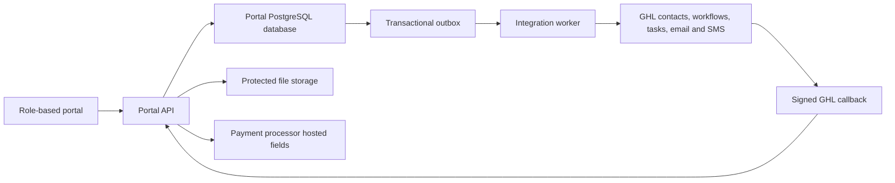

# Exemplary Property Management Portal

## Final Hybrid Build Blueprint and Field Layouts

Prepared for Exemplary Services LLC and True Products Network  
Version: 2.0 — Final hybrid architecture  
Date: July 31, 2026  
Primary time zone: America/Chicago

---

## 1. Authority and document order

This is the controlling developer handoff for OpenClaw and any other developer working on the portal.

When project files disagree, use this order:

1. This Final Hybrid Build Blueprint and Field Layouts document.
2. Later written decisions approved by Nigel.
3. The Complete Four-Role Interface and GHL Integration Build Specification for individual screen descriptions and acceptance details.
4. The GHL field-backup workbook for historical field labels, source-data cleanup, and existing GHL identifiers.
5. Images in `assets/` for the approved visual style.

The earlier statement that GHL holds all operational property-management records is retired. The Portal Database is the authoritative source for property-management data and relationships.

## 2. Final architecture decision

### 2.1 Portal Database is authoritative for

- Associations, properties, units, people, vendors, ownership, occupancy, board memberships, and service relationships.
- Maintenance requests, triage, quotes, assignments, approvals, schedules, completion, and resolution.
- Inspections, checklists, findings, corrective actions, and follow-up.
- Document records, file links, versions, acknowledgments, and access rules.
- Compliance matters, notices, responses, hearings, decisions, corrective actions, and closure.
- Portal roles, scoped access, forms, messages, activity, audit history, and user actions.
- Payment requests and processor-status references needed for the portal interface. The payment processor remains authoritative for transaction status; the accounting platform remains authoritative for the formal ledger.

### 2.2 GHL is used for

- Contact projection and contact activity.
- Workflow execution.
- Email and SMS delivery.
- Task creation and reminders.
- Conversation activity and delivery results.
- Minimal workflow shadows for existing custom objects when a GHL workflow needs an object record.

### 2.3 GHL is not used for

- Portal authorization or row-level access decisions.
- The authoritative Property, Unit, Maintenance, Inspection, Document, or Compliance record.
- The authoritative relationship matrix.
- Direct portal form storage.
- Payment credentials, bank credentials, the formal ledger, or bank reconciliation.

## 3. System topology



### 3.1 Required write pattern

1. The browser sends a portal-native form to the Portal API.
2. The API checks the session, active role, association scope, record relationships, and field rules.
3. One database transaction writes the business record, relationships, audit event, and integration-outbox event.
4. The API returns the portal record and status. A GHL outage must not invalidate the portal submission.
5. A worker sends the event to GHL with an idempotency key.
6. GHL finds or updates the related Contact, starts the named workflow, and creates permitted tasks or messages.
7. GHL posts a signed result callback. The portal stores the workflow result in the activity timeline.

### 3.2 Required read pattern

All portal screens read from the Portal Database or its cache. The portal does not assemble property screens by querying GHL objects. GHL conversation and task summaries may be read through the middleware and cached, but they must be labeled as GHL activity.

## 4. Recommended application structure

Use a PostgreSQL-compatible relational database. Keep business data, relationships, authorization, audit records, and integration state in separate schemas or clearly separated modules.

```text
property-management-portal/
├── app/
│   ├── auth/
│   ├── management/
│   ├── admin/
│   ├── owner-resident/
│   ├── board/
│   ├── vendor/
│   └── api/v1/
├── components/
│   ├── shell/
│   ├── lists/
│   ├── detail-tabs/
│   ├── forms/
│   ├── files/
│   ├── activity/
│   └── workflow-status/
├── database/
│   ├── migrations/
│   ├── seeds/
│   ├── policies/
│   └── views/
├── services/
│   ├── permissions/
│   ├── ghl/
│   ├── outbox/
│   ├── webhooks/
│   ├── files/
│   ├── payments/
│   └── audit/
├── tests/
│   ├── access/
│   ├── relationships/
│   ├── forms/
│   ├── integration/
│   └── ui/
└── assets/reference-screens/
```

## 5. Identity, roles, and authorization

### 5.1 Portal roles

| Portal role | Scope | Main access |
|---|---|---|
| Admin User | System-wide | All management functions plus user, role, integration, settings, and audit administration |
| Management Staff | Assigned Associations and Properties | Day-to-day records, maintenance, inspections, documents, compliance, communications, and reports |
| Bookkeeper / Finance Restricted | Assigned Associations | Payment-status and financial-handoff screens only; no unrestricted legal or maintenance notes |
| Owner | Related Associations, Properties, and Units | Their records, requests, documents, notices, payments, and messages |
| Board Member | Assigned Association | Board summaries, approvals, meetings, permitted documents, maintenance, inspection, compliance, and reports |
| Resident / Occupant | Related Units | Their unit, requests, permitted documents, notices, and messages |
| Vendor Contact | Vendor Company and assigned jobs | Assigned work, quotes, schedules, completion, invoices, credentials, and messages |

### 5.2 Role storage

- `people` stores the person profile.
- `user_accounts` links the authenticated identity to one person.
- `role_assignments` stores a role plus optional Association, Property, Unit, or Vendor scope.
- `association_people`, `unit_people`, `vendor_people`, and staff-assignment tables store business relationships.
- Portal access is calculated from the Portal Database. GHL Contact Role(s) is a synchronized projection for CRM segmentation and workflow conditions.
- Staff who also enter GHL may have a separate GHL User account. A GHL User role does not grant portal access.

### 5.3 Contact Role(s) values synchronized to GHL

`Admin User; Management Staff; Bookkeeper / Finance Restricted; Owner; Board Member; Resident / Occupant; Vendor Contact; Attorney; Insurance Contact; Emergency Contact; Other`

This is a multi-select. Do not create a combined “Owner and Board Member” option; select both individual roles.

## 6. Portal Database record catalog

### 6.1 Main business tables

| Table | Purpose | Human identifier | Authoritative system |
|---|---|---|---|
| `associations` | Managed Association or community | `ASSOC-0001` | Portal Database |
| `properties` | Managed building, development, or address | `PROP-0001` | Portal Database |
| `units` | Unit, lot, or home within a Property | `UNIT-0001` | Portal Database |
| `people` | Owners, residents, board members, staff, and vendor contacts | `PERS-0001` | Portal Database; GHL Contact projection |
| `vendors` | Service-provider companies | `VEND-0001` | Portal Database |
| `maintenance_requests` | Repair or service request | `MR-2026-0001` | Portal Database |
| `inspections` | Inspection and follow-up | `INSP-2026-0001` | Portal Database; existing GHL object becomes an optional shadow |
| `documents` | Document register and file metadata | `DOC-0001` | Portal Database; existing GHL object becomes an optional shadow |
| `compliance_matters` | Complaint, violation, or compliance case | `COMP-2026-0001` | Portal Database; existing GHL object becomes an optional shadow |
| `payment_requests` | Portal payment intent and safe processor status | `PAY-2026-0001` | Portal Database for display; processor for transaction status |

### 6.2 Required system columns on every main table

| Column | Type | Rule |
|---|---|---|
| `id` | uuid primary key | Internal only; never shown as the human record number |
| `organization_id` | uuid FK | Management-company boundary |
| `created_at`, `updated_at` | timestamptz | Set by the server |
| `created_by`, `updated_by` | uuid FK | Authenticated user or integration actor |
| `record_version` | integer | Increment on each write; used for optimistic locking and sync |
| `archived_at` | timestamptz nullable | Soft archive; do not hard-delete business records through ordinary UI |

### 6.3 Relationship and process tables

| Table | Main columns and purpose |
|---|---|
| `association_people` | association, person, business role, board position, term dates, active dates |
| `unit_people` | unit, person, relationship type, ownership share when approved, start/end dates, primary flag |
| `property_vendors` | property, vendor, service category, approval status, active dates |
| `vendor_people` | vendor, person, job title, primary-contact flag, active dates |
| `maintenance_vendor_assignments` | request, vendor, invitation, response, awarded flag, schedule, completion |
| `maintenance_quotes` | assignment, amount, currency, scope, submitted date, status, files |
| `approval_requests` | target record, approval type, approver scope, decision, reason, dates |
| `inspection_findings` | inspection, category, severity, finding, corrective action, due date, status |
| `inspection_links` | inspection to generated Maintenance Request or Compliance Matter |
| `document_links` | document connected to one or more approved records with relationship label |
| `document_acknowledgments` | document, person, requested, viewed, acknowledged, signed dates |
| `compliance_parties` | matter, person, party role, notice/response status |
| `messages` and `message_participants` | portal threads, visibility, participants, GHL message reference |
| `announcements` and `announcement_recipients` | Association-scoped notices and delivery/acknowledgment state |
| `meetings`, `meeting_attendees`, and `meeting_documents` | Association meetings, schedule, packets, attendance, minutes, and linked files |
| `user_accounts` and `role_assignments` | login identity, access status, MFA flag, system role, and scoped access |
| `property_staff_assignments` | staff responsibility by Property and date range |
| `notifications` | in-portal notification, read state, action link, and GHL delivery summary |
| `workflow_runs` | portal event, GHL workflow code, current state, timestamps, and result summary |
| `lookup_values` | controlled dropdown values, display order, active dates, and version |
| `report_exports` | requested report, filters, generated file, status, expiry, and requester |
| `files` | protected storage key, filename, type, size, checksum, uploader, confidentiality |
| `activity_events` | user-readable record timeline |
| `audit_events` | immutable security and change audit |
| `integration_outbox` | queued GHL events, attempts, next retry, status, correlation ID |
| `integration_mappings` | portal record ID to GHL Contact/object/task/workflow identifiers |
| `webhook_receipts` | signed inbound-event IDs and idempotent processing result |

## 7. Authoritative relationship matrix

| Parent / first record | Relationship | Child / second record | Cardinality | Storage | Screen behavior |
|---|---|---|---|---|---|
| Association | Has Properties | Property | 1:M | `properties.association_id` | Association page lists every Property; Property header links back to Association |
| Property | Contains Units | Unit | 1:M | `units.property_id` | Property page lists Units; Unit header links to Property and derived Association |
| Association | Has People | Person | M:M | `association_people` | Owners, Board, staff, attorneys, and other authorized contacts appear by role |
| Unit | Has Owners / Occupants | Person | M:M | `unit_people` | Supports joint ownership and different owners/occupants |
| Vendor | Serves Properties | Property | M:M | `property_vendors` | Both Property and Vendor pages show the relationship |
| Property | Has Maintenance Requests | Maintenance Request | 1:M | `maintenance_requests.property_id` | Required for every request |
| Unit | Has Maintenance Requests | Maintenance Request | 1:M optional | `maintenance_requests.unit_id` | Null for common-area or property-wide work |
| Person | Reported Requests | Maintenance Request | 1:M | `maintenance_requests.reported_by_person_id` | Reporter is clickable and scope checked |
| Vendor | Is Invited / Assigned | Maintenance Request | M:M | assignment and quote tables | Several quotes allowed; one awarded assignment at a time unless approved otherwise |
| Property | Has Inspections | Inspection | 1:M | `inspections.property_id` | Required |
| Unit | Has Inspections | Inspection | 1:M optional | `inspections.unit_id` | Null for property-wide inspection |
| Inspection | Creates Follow-up | Maintenance / Compliance | M:M | `inspection_links` | Origin and resulting record appear on both detail pages |
| Document | Relates To | Approved business record | M:M | `document_links` | Show exact relationship label and clickable record |
| Property | Has Compliance Matters | Compliance Matter | 1:M | `compliance_matters.property_id` | Required unless a future approved Association-only case type is added |
| Unit | Has Compliance Matters | Compliance Matter | 1:M optional | `compliance_matters.unit_id` | Null for property-wide matter |
| Person | Is Party To | Compliance Matter | M:M | `compliance_parties` | Role and visibility are stored per party |

### 7.1 No duplicate Association relationship on Maintenance Request

The Association for a Maintenance Request is always derived through:

`Maintenance Request → Property → Association`

Do not add `association_id` to `maintenance_requests`. Create a database view or indexed query for Association filters. The same derived rule applies to a Unit’s Association.

### 7.2 Relationships do not come from GHL

GHL object associations may be kept as a workflow convenience, but they are never the authoritative relationship and never grant portal access. A GHL association mismatch must create an integration exception; it must not rewrite the Portal Database automatically.

## 8. Search and detail-page behavior

Every major record is searchable within the active role and Association scope. Selecting a result opens the record detail page. Related records are clickable and loaded from the Portal Database.

| Detail page | Required related-record areas |
|---|---|
| Association | Properties, Units through Properties, People, Board, Maintenance, Inspections, Documents, Compliance, Communications, payment/financial links, and Activity |
| Property | Association, Units, People, Maintenance, Vendors, Inspections, Documents, Compliance, payment/financial links, and Activity |
| Unit | Property, derived Association, Owners/Occupants, Maintenance, Inspections, Documents, Compliance, and Activity |
| Person | Roles, Associations, Properties and Units through relationships, Requests, Documents, Messages, consent, portal access, and Activity |
| Vendor | Contacts, serviced Properties, credentials, assigned jobs, quotes, invoices, Documents, Messages, and Activity |
| Maintenance Request | Property, optional Unit, Reporter, staff, invited/awarded Vendors, quotes, approval, schedule, Files, Messages, workflow status, and Activity |
| Inspection | Property, optional Unit, inspector, checklist, findings, Files, generated Maintenance/Compliance records, and Activity |
| Document | File/version, access level, delivery, signature/acknowledgment, every linked record, and Activity |
| Compliance Matter | Property, optional Unit, involved People, source Inspection, Notices, Files, hearing, decision, corrective action, and Activity |

### 8.1 Property Detail layout — MG-07

- Header: Property name, full address, status, Property ID, and clickable Association.
- Summary cards: Units, occupancy, open Maintenance, upcoming Inspections, expiring Documents, and open Compliance.
- Tabs in this order: Overview, Units, People, Maintenance, Vendors, Inspections, Documents, Compliance, Financial Links, Activity.
- Each tab has scoped search, filters, counts, clickable rows, empty state, and add action when the active role permits it.
- The Overview tab shows identification/address, operations, assigned staff, management dates, emergency notes, and recent activity.


## 9. Canonical field layouts

### 9.1 Field rules

- The tables below are the canonical portal labels and columns derived from the approved GHL field backup.
- Portal Database columns are authoritative. The old proposed GHL keys are not database keys.
- GHL Contact fields and custom-object field IDs must be inventoried and recorded in `integration_mappings` or configuration before live sync.
- Existing Inspection, Document Record, and Compliance Matter objects are reused only as workflow shadows when needed. Do not recreate them.
- Relationship fields are stored as foreign keys or relationship-table rows, not repeated names or IDs in text fields.

### Association

| Screen section | Field label | Portal Database column | DB type / portal control | Required | GHL use | Validation / rule |
|---|---|---|---|---|---|---|
| Identification | Association ID | `associations.association_code` | text / input | Yes | Event context only | Required for imports and relationships |
| Identification | Legal Association Name | `associations.legal_association_name` | text / input | Yes | Event context only | Use legal name |
| Identification | Common/Short Name | `associations.common_short_name` | text / input | No | Event context only | — |
| Identification | Association Status | `associations.association_status` | text FK / select | Yes | Event context only | See Dropdown Choices |
| Identification | Association Type | `associations.association_type` | text FK / select | No | Event context only | See Dropdown Choices |
| Identification | Tax ID/EIN | `associations.tax_id_ein` | text / input | No | No GHL sync | Sensitive; restrict access if retained |
| Contact and Operations | Main Address | `associations.main_address` | text / input | No | Event context only | — |
| Contact and Operations | City | `associations.city` | text / input | No | Event context only | — |
| Contact and Operations | State | `associations.state` | text / input | No | Event context only | Two-letter code |
| Contact and Operations | ZIP | `associations.zip` | text / input | No | Event context only | Store as text |
| Contact and Operations | Main Phone | `associations.main_phone` | text / telephone | No | Event context only | — |
| Contact and Operations | Main Email | `associations.main_email` | citext / email | No | Event context only | — |
| Contact and Operations | Website | `associations.website` | text / URL input | No | Event context only | — |
| Contact and Operations | Management Start Date | `associations.management_start_date` | date / date picker | No | Event context only | yyyy-mm-dd |
| Contact and Operations | Fiscal Year End Month | `associations.fiscal_year_end_month` | text FK / select | No | Event context only | Month name |
| Contact and Operations | Annual Meeting Month | `associations.annual_meeting_month` | text FK / select | No | Event context only | Month name |
| Contact and Operations | Number of Properties | `association_summary.property_count (derived)` | derived integer / read-only | No | Event context only | Whole number |
| Contact and Operations | Number of Units | `association_summary.unit_count (derived)` | derived integer / read-only | No | Event context only | Whole number |
| Contact and Operations | Financial Platform Name | `associations.financial_platform_name` | text / input | No | Event context only | No credentials |
| Contact and Operations | Financial Portal Link | `associations.financial_portal_link` | text / URL input | No | Event context only | No credentials in URL |
| Contact and Operations | Records/Document Storage Link | `associations.records_document_storage_link` | text / URL input | No | Event context only | — |
| Contact and Operations | Emergency Instructions | `associations.emergency_instructions` | text / textarea | No | Event context only | No alarm/access codes |
| Contact and Operations | General Notes | `associations.general_notes` | text / textarea | No | Event context only | — |

### Person

| Screen section | Field label | Portal Database column | DB type / portal control | Required | GHL use | Validation / rule |
|---|---|---|---|---|---|---|
| Identity and Roles | Contact ID | `people.person_code` | text / input | Yes | GHL Contact projection | Required for imports |
| Identity and Roles | First Name | `people.first_name` | text / input | Yes | GHL Contact projection | One person per contact |
| Identity and Roles | Last Name | `people.last_name` | text / input | Yes | GHL Contact projection | One person per contact |
| Identity and Roles | Contact Role(s) | `role_assignments.role_code` | join table / multi-select | Yes | GHL Contact projection | See Dropdown Choices |
| Identity and Roles | Board Position | `association_people.board_position` | text FK / select | No | GHL Contact projection | See Dropdown Choices |
| Identity and Roles | Board Term Start | `association_people.board_term_start` | date / date picker | No | GHL Contact projection | yyyy-mm-dd |
| Identity and Roles | Board Term End | `association_people.board_term_end` | date / date picker | No | GHL Contact projection | yyyy-mm-dd |
| Identity and Roles | Preferred Contact Method | `people.preferred_contact_method` | text FK / select | No | GHL Contact projection | See Dropdown Choices |
| Identity and Roles | Email Allowed | `people.email_allowed` | boolean / checkbox | No | GHL Contact projection | — |
| Identity and Roles | Text Allowed | `people.text_allowed` | boolean / checkbox | No | GHL Contact projection | — |
| Identity and Roles | Portal/Resource Link | `people.portal_resource_link` | text / URL input | No | GHL Contact projection | — |
| Identity and Roles | Contact Status | `people.contact_status` | text FK / select | Yes | GHL Contact projection | Active; Inactive |

### Vendor

| Screen section | Field label | Portal Database column | DB type / portal control | Required | GHL use | Validation / rule |
|---|---|---|---|---|---|---|
| Vendor Profile | Vendor ID | `vendors.vendor_code` | text / input | Yes | Event context only | Required for imports |
| Vendor Profile | Vendor Status | `vendors.vendor_status` | text FK / select | Yes | Event context only | See Dropdown Choices |
| Vendor Profile | Vendor Type | `vendors.vendor_type` | text FK / select | Yes | Event context only | See Dropdown Choices |
| Vendor Profile | Services Provided | `vendors.services_provided` | text / textarea | No | Event context only | — |
| Vendor Profile | Service Area | `vendors.service_area` | text / input | No | Event context only | — |
| Vendor Profile | Approved Vendor | `vendors.approved_vendor` | boolean / checkbox | No | Event context only | — |
| Vendor Profile | Preferred Vendor | `vendors.preferred_vendor` | boolean / checkbox | No | Event context only | — |
| Vendor Profile | Emergency Availability | `vendors.emergency_availability` | boolean / checkbox | No | Event context only | — |
| Vendor Profile | Insurance Status | `vendors.insurance_status` | text FK / select | No | Event context only | Current; Expired; Missing; Under Review |
| Vendor Profile | Insurance Expiration | `vendors.insurance_expiration` | date / date picker | No | Event context only | yyyy-mm-dd |
| Vendor Profile | License Number | `vendors.license_number` | text / input | No | Event context only | Store as text |
| Vendor Profile | License Expiration | `vendors.license_expiration` | date / date picker | No | Event context only | yyyy-mm-dd |
| Vendor Profile | W-9 Received | `vendors.w_9_received` | boolean / checkbox | No | Event context only | — |
| Vendor Profile | Contract Status | `vendors.contract_status` | text FK / select | No | Event context only | None; Pending; Active; Expired; Terminated |
| Vendor Profile | Contract Expiration | `vendors.contract_expiration` | date / date picker | No | Event context only | yyyy-mm-dd |
| Vendor Profile | Document Folder Link | `vendors.document_folder_link` | text / URL input | No | Event context only | — |
| Vendor Profile | Performance Notes | `vendors.performance_notes` | text / textarea | No | Event context only | — |

### Property

| Screen section | Field label | Portal Database column | DB type / portal control | Required | GHL use | Validation / rule |
|---|---|---|---|---|---|---|
| Identification and Address | Property ID | `properties.property_code` | text / input | Yes | Event context only | Required for imports |
| Identification and Address | Property Name | `properties.property_name` | text / input | Yes | Event context only | Primary display field |
| Identification and Address | Property Status | `properties.property_status` | text FK / select | Yes | Event context only | See Dropdown Choices |
| Identification and Address | Property Type | `properties.property_type` | text FK / select | No | Event context only | See Dropdown Choices |
| Identification and Address | Street Address | `properties.street_address` | text / input | Yes | Event context only | — |
| Identification and Address | Address Line 2 | `properties.address_line_2` | text / input | No | Event context only | — |
| Identification and Address | City | `properties.city` | text / input | Yes | Event context only | — |
| Identification and Address | State | `properties.state` | text / input | Yes | Event context only | Two-letter code |
| Identification and Address | ZIP | `properties.zip` | text / input | Yes | Event context only | Store as text |
| Identification and Address | County | `properties.county` | text / input | No | Event context only | — |
| Identification and Address | Number of Units | `property_summary.unit_count (derived)` | derived integer / read-only | No | Event context only | Whole number |
| Identification and Address | Year Built | `properties.year_built` | integer / number | No | Event context only | Four digits |
| Operations | Main Access Instructions | `properties.main_access_instructions` | text / textarea | No | Event context only | Exclude door/alarm codes |
| Operations | Emergency Notes | `properties.emergency_notes` | text / textarea | No | Event context only | — |
| Operations | Primary Staff Contact | `properties.primary_staff_contact` | uuid FK / user picker | No | Event context only | Prefer assigned user when available |
| Operations | Management Start Date | `properties.management_start_date` | date / date picker | No | Event context only | yyyy-mm-dd |
| Operations | Management End Date | `properties.management_end_date` | date / date picker | No | Event context only | Blank when ongoing; do not enter prose |
| Operations | Financial Portal Link | `properties.financial_portal_link` | text / URL input | No | Event context only | Must be a valid URL, not 'custom GHL payment link' |
| Operations | Document Folder Link | `properties.document_folder_link` | text / URL input | No | Event context only | — |
| Operations | General Notes | `properties.general_notes` | text / textarea | No | Event context only | — |

### Unit

| Screen section | Field label | Portal Database column | DB type / portal control | Required | GHL use | Validation / rule |
|---|---|---|---|---|---|---|
| Unit Record | Unit ID | `units.unit_code` | text / input | Yes | Event context only | Use same format everywhere |
| Unit Record | Unit/Lot Number | `units.unit_lot_number` | text / input | Yes | Event context only | Store as text |
| Unit Record | Unit Display Name | `units.unit_display_name` | text / input | Yes | Event context only | Primary display field |
| Unit Record | Unit Status | `units.unit_status` | text FK / select | Yes | Event context only | Active; Inactive |
| Unit Record | Unit Type | `units.unit_type` | text FK / select | No | Event context only | Condo; Apartment; Townhome; Lot; Single Family; Other |
| Unit Record | Floor | `units.floor` | text / input | No | Event context only | — |
| Unit Record | Bedrooms | `units.bedrooms` | integer / number | No | Event context only | Whole number |
| Unit Record | Bathrooms | `units.bathrooms` | numeric(4,1) / number | No | Event context only | Decimal allowed |
| Unit Record | Occupancy Status | `units.occupancy_status` | text FK / select | No | Event context only | See Dropdown Choices |
| Unit Record | Owner Occupied | `units.owner_occupied` | boolean / checkbox | No | Event context only | — |
| Unit Record | Rental Status | `units.rental_status` | text FK / select | No | Event context only | See Dropdown Choices |
| Unit Record | Mailing Address if Different | `units.mailing_address_if_different` | text / textarea | No | Event context only | — |
| Unit Record | Parking Space | `units.parking_space` | text / input | No | Event context only | — |
| Unit Record | Storage Space | `units.storage_space` | text / input | No | Event context only | — |
| Unit Record | Move-In Date | `units.move_in_date` | date / date picker | No | Event context only | yyyy-mm-dd |
| Unit Record | Move-Out Date | `units.move_out_date` | date / date picker | No | Event context only | yyyy-mm-dd |
| Unit Record | Access Notes | `units.access_notes` | text / textarea | No | Event context only | Exclude codes |
| Unit Record | General Notes | `units.general_notes` | text / textarea | No | Event context only | — |

### Maintenance Request

| Screen section | Field label | Portal Database column | DB type / portal control | Required | GHL use | Validation / rule |
|---|---|---|---|---|---|---|
| Request | Request Number | `maintenance_requests.request_number` | text / input | Yes | GHL workflow event/shadow | Primary display field |
| Request | Date Reported | `maintenance_requests.date_reported` | timestamptz / date-time | Yes | GHL workflow event/shadow | — |
| Request | Category | `maintenance_requests.category` | text FK / select | Yes | GHL workflow event/shadow | See Dropdown Choices |
| Request | Short Title | `maintenance_requests.short_title` | text / input | Yes | GHL workflow event/shadow | — |
| Request | Full Description | `maintenance_requests.full_description` | text / textarea | Yes | GHL workflow event/shadow | — |
| Request | Urgency | `maintenance_requests.urgency` | text FK / select | Yes | GHL workflow event/shadow | Emergency; Urgent; Routine |
| Request | Permission to Enter | `maintenance_requests.permission_to_enter` | text FK / select | No | GHL workflow event/shadow | Yes; No; Contact First |
| Request | Photos/File Link | `document_links / files` | file reference / uploader | No | GHL workflow event/shadow | — |
| Work Status | Current Status | `maintenance_requests.current_status` | text FK / select | Yes | GHL workflow event/shadow | See Dropdown Choices |
| Work Status | Assigned Staff | `maintenance_requests.assigned_staff` | uuid FK / user picker | No | GHL workflow event/shadow | — |
| Work Status | Board Approval Required | `maintenance_requests.board_approval_required` | boolean / checkbox | No | GHL workflow event/shadow | — |
| Work Status | Approval Status | `maintenance_requests.approval_status` | text FK / select | No | GHL workflow event/shadow | Not Required; Pending; Approved; Declined |
| Work Status | Quote Requested Date | `maintenance_requests.quote_requested_date` | date / date picker | No | GHL workflow event/shadow | — |
| Work Status | Quote Received Date | `maintenance_requests.quote_received_date` | date / date picker | No | GHL workflow event/shadow | — |
| Work Status | Scheduled Date | `maintenance_requests.scheduled_date` | timestamptz / date-time | No | GHL workflow event/shadow | — |
| Work Status | Completion Date | `maintenance_requests.completion_date` | timestamptz / date-time | No | GHL workflow event/shadow | — |
| Work Status | Completion Notes | `maintenance_requests.completion_notes` | text / textarea | No | GHL workflow event/shadow | — |
| Work Status | Owner Confirmation | `maintenance_requests.owner_confirmation` | text FK / select | No | GHL workflow event/shadow | Pending; Confirmed; Disputed; Not Required |
| Work Status | Closed Date | `maintenance_requests.closed_date` | timestamptz / date-time | No | GHL workflow event/shadow | — |
| Work Status | Notes | `maintenance_requests.notes` | text / textarea | No | GHL workflow event/shadow | — |

### Inspection

| Screen section | Field label | Portal Database column | DB type / portal control | Required | GHL use | Validation / rule |
|---|---|---|---|---|---|---|
| Inspection | Inspection Number | `inspections.inspection_number` | text / input | Yes | Event + optional GHL shadow | Primary display field |
| Inspection | Inspection Type | `inspections.inspection_type` | text FK / select | Yes | Event + optional GHL shadow | — |
| Inspection | Requested Date | `inspections.requested_date` | date / date picker | No | Event + optional GHL shadow | — |
| Inspection | Scheduled Date | `inspections.scheduled_date` | timestamptz / date-time | No | Event + optional GHL shadow | — |
| Inspection | Completed Date | `inspections.completed_date` | timestamptz / date-time | No | Event + optional GHL shadow | — |
| Inspection | Overall Result | `inspections.overall_result` | text FK / select | No | Event + optional GHL shadow | See Dropdown Choices |
| Inspection | Summary of Findings | `inspections.summary_of_findings` | text / textarea | No | Event + optional GHL shadow | — |
| Inspection | Corrective Action Required | `inspections.corrective_action_required` | boolean / checkbox | No | Event + optional GHL shadow | — |
| Inspection | Follow-Up Due Date | `inspections.follow_up_due_date` | date / date picker | No | Event + optional GHL shadow | — |
| Inspection | Follow-Up Completed Date | `inspections.follow_up_completed_date` | date / date picker | No | Event + optional GHL shadow | — |
| Inspection | Inspection Status | `inspections.inspection_status` | text FK / select | Yes | Event + optional GHL shadow | See Dropdown Choices |
| Inspection | Notes | `inspections.notes` | text / textarea | No | Event + optional GHL shadow | — |

### Document Record

| Screen section | Field label | Portal Database column | DB type / portal control | Required | GHL use | Validation / rule |
|---|---|---|---|---|---|---|
| Document Register | Document ID | `documents.document_code` | text / input | Yes | Event + optional GHL shadow | Required for relationships |
| Document Register | Document Name | `documents.document_name` | text / input | Yes | Event + optional GHL shadow | Primary display field |
| Document Register | Document Type | `documents.document_type` | text FK / select | Yes | Event + optional GHL shadow | See Dropdown Choices |
| Document Register | File Name | `files.original_filename (derived)` | text / input | Yes | Event + optional GHL shadow | — |
| Document Register | File/Folder Link | `documents.current_file_id` | file reference / uploader | No | Event + optional GHL shadow | — |
| Document Register | Effective Date | `documents.effective_date` | date / date picker | No | Event + optional GHL shadow | — |
| Document Register | Expiration Date | `documents.expiration_date` | date / date picker | No | Event + optional GHL shadow | — |
| Document Register | Signature Required | `documents.signature_required` | boolean / checkbox | No | Event + optional GHL shadow | — |
| Document Register | Signed Date | `documents.signed_date` | date / date picker | No | Event + optional GHL shadow | — |
| Document Register | Delivered Date | `documents.delivered_date` | date / date picker | No | Event + optional GHL shadow | — |
| Document Register | Delivery Method | `documents.delivery_method` | text FK / select | No | Event + optional GHL shadow | Email; Portal; Mail; In Person; Other |
| Document Register | Version | `documents.version` | text / input | No | Event + optional GHL shadow | — |
| Document Register | Confidentiality | `documents.confidentiality` | text FK / select | No | Event + optional GHL shadow | Public; Owner; Board; Internal; Restricted |
| Document Register | Document Status | `documents.document_status` | text FK / select | Yes | Event + optional GHL shadow | Draft; Current; Expiring; Expired; Archived |

### Compliance Matter

| Screen section | Field label | Portal Database column | DB type / portal control | Required | GHL use | Validation / rule |
|---|---|---|---|---|---|---|
| Compliance | Matter Number | `compliance_matters.matter_number` | text / input | Yes | Event + optional GHL shadow | Primary display field |
| Compliance | Matter Type | `compliance_matters.matter_type` | text FK / select | Yes | Event + optional GHL shadow | — |
| Compliance | Date Reported | `compliance_matters.date_reported` | date / date picker | Yes | Event + optional GHL shadow | — |
| Compliance | Short Title | `compliance_matters.short_title` | text / input | Yes | Event + optional GHL shadow | — |
| Compliance | Description | `compliance_matters.description` | text / textarea | Yes | Event + optional GHL shadow | — |
| Compliance | Rule/Policy Reference | `compliance_matters.rule_policy_reference` | text / input | No | Event + optional GHL shadow | — |
| Compliance | Evidence Link | `document_links / files` | file reference / uploader | No | Event + optional GHL shadow | — |
| Compliance | Compliance Status | `compliance_matters.compliance_status` | text FK / select | Yes | Event + optional GHL shadow | See Dropdown Choices |
| Compliance | Notice Date | `compliance_matters.notice_date` | date / date picker | No | Event + optional GHL shadow | — |
| Compliance | Response Deadline | `compliance_matters.response_deadline` | date / date picker | No | Event + optional GHL shadow | — |
| Compliance | Response Received Date | `compliance_matters.response_received_date` | date / date picker | No | Event + optional GHL shadow | — |
| Compliance | Hearing Required | `compliance_matters.hearing_required` | boolean / checkbox | No | Event + optional GHL shadow | — |
| Compliance | Hearing Date | `compliance_matters.hearing_date` | timestamptz / date-time | No | Event + optional GHL shadow | — |
| Compliance | Board Decision | `compliance_matters.board_decision` | text / textarea | No | Event + optional GHL shadow | — |
| Compliance | Corrective Action | `compliance_matters.corrective_action` | text / textarea | No | Event + optional GHL shadow | — |
| Compliance | Follow-Up Date | `compliance_matters.follow_up_date` | date / date picker | No | Event + optional GHL shadow | — |
| Compliance | Resolution | `compliance_matters.resolution` | text / textarea | No | Event + optional GHL shadow | — |
| Compliance | Closed Date | `compliance_matters.closed_date` | date / date picker | No | Event + optional GHL shadow | — |
| Compliance | Notes | `compliance_matters.notes` | text / textarea | No | Event + optional GHL shadow | — |

## 10. Required portal-only field additions

### 10.1 People, authentication, and GHL sync

| Field | Portal column | Type | Rule |
|---|---|---|---|
| Primary Email | `people.primary_email` | citext | Unique when present; sync to GHL Contact |
| Primary Phone | `people.primary_phone` | text | E.164 normalized when possible; sync to GHL Contact |
| External Auth Subject | `user_accounts.auth_subject` | text | Unique; never sent to GHL |
| Portal Access Status | `user_accounts.access_status` | controlled text | Invited, Active, Suspended, Revoked |
| Invitation Status | `user_accounts.invitation_status` | controlled text | Not Invited, Pending, Accepted, Expired, Revoked |
| MFA Required | `user_accounts.mfa_required` | boolean | Required for Admin, Management, Board approvers, and payment administrators |
| Last Sign-in | `user_accounts.last_sign_in_at` | timestamptz | Auth-provider callback only |
| GHL Contact ID | `integration_mappings.external_id` | text | Provider=GHL; entity=Contact; unique per GHL location |
| Sync Status | `integration_mappings.sync_status` | controlled text | Pending, Synced, Failed, Blocked |

### 10.2 Maintenance intake and processing

| Section | Field / column | Type / control | Rule |
|---|---|---|---|
| Location | `location_type` | select | Unit, Common Area, Exterior, Entire Property, Other |
| Problem | `date_problem_began` | date | Optional |
| Safety | `immediate_danger` | boolean | Emergency routing input |
| Safety | `active_water_flow` | boolean | Emergency routing input |
| Safety | `damage_occurring` | boolean | Emergency routing input |
| Access | `contact_before_entry` | boolean | Must agree with permission-to-enter choice |
| Access | `pets_present` | boolean | Conditional pet details |
| Access | `pet_details` | text | Required when pets are present |
| Access | `access_instructions` | text | Restricted; do not store alarm, gate, or door credentials in ordinary fields |
| Schedule | `preferred_visit_times` | text or structured availability | User preference, not confirmed appointment |
| Operations | `source` | controlled text | Owner Portal, Resident Portal, Management, Inspection, Email Import, API |
| Operations | `target_response_at` | timestamptz | Set by triage rules |
| Operations | `resolved_at` | timestamptz | Set when work is resolved |
| Operations | `reopened_at` | timestamptz | Set when a closed/completion-review request is reopened |

### 10.3 Inspection structure

Use `inspection_templates`, `inspection_template_items`, `inspection_checklist_responses`, and `inspection_findings`. Do not place a whole checklist in one long-text field. Each response stores result, observation, files, severity, corrective-action flag, and due date.

### 10.4 Files and documents

The `documents` table stores register metadata. The `files` table stores the protected object key, original filename, MIME type, byte size, checksum, uploader, confidentiality, malware-scan status, and retention state. Portal screens receive short-lived authorized download links, never permanent public file URLs.

### 10.5 Payment operations

| Field | Type | Rule |
|---|---|---|
| Payment Request ID | text unique | Human identifier |
| Processor | controlled text | Selected during payment discovery |
| Processor Customer / Session / Transaction Reference | text | Safe references only |
| Person, Association, Property, Unit | FKs | Association required; Property/Unit when relevant |
| Obligation Reference and Description | text | Links the payment to the external charge or assessment |
| Amount and Currency | numeric + char(3) | Stored for display and processor verification, not as the formal ledger |
| Operational Status | controlled text | Created, Pending, Authorized, Settled, Failed, Returned, Refunded, Voided, Disputed |
| Receipt Reference / Link | text | Safe processor receipt reference |
| Accounting Handoff Status | controlled text | Not Sent, Pending, Accepted, Failed, Exception |
| Verified Event ID | text unique | Reject duplicate processor events |

Raw card numbers, full bank-account numbers, CVV, bank-login data, and processor secrets are never stored in the Portal Database or GHL.

### 10.6 Approvals

| Field | Portal column | Type | Rule |
|---|---|---|---|
| Approval Number | `approval_requests.approval_number` | text unique | Human identifier |
| Target Type / ID | `target_type`, `target_id` | controlled text + uuid | Must identify an authorized Maintenance, Compliance, Document, Announcement, or other approved target |
| Approval Type | `approval_type` | controlled text | Board, Management, Owner, Financial Review, Other |
| Status | `status` | controlled text | Draft, Requested, Pending, Approved, Declined, Cancelled, Expired |
| Requested By / At | uuid + timestamptz | server set | Audit-linked |
| Due At | timestamptz | optional | Drives GHL reminders |
| Decision / Reason | text | conditional | Required for approve/decline according to policy |
| Decided By / At | uuid + timestamptz | server set | Immutable decision history |

### 10.7 Meetings and board activity

| Field | Portal column | Type | Rule |
|---|---|---|---|
| Meeting Number | `meetings.meeting_number` | text unique | Human identifier |
| Association | `meetings.association_id` | uuid FK | Required |
| Title / Type | text + controlled text | inputs | Board, Annual, Special, Committee, Other |
| Start / End | timestamptz | date-time | End must follow start |
| Location / Virtual Link | text | conditional | Safe access details only |
| Status | controlled text | select | Draft, Scheduled, Completed, Cancelled |
| Agenda / Packet / Minutes | document links | relationship picker | Use Document Records and access rules |
| Quorum Required / Met | integer + boolean | restricted | Board view and audit |
| Attendance | `meeting_attendees` | relationship rows | Person, role, response, attendance, vote eligibility |

### 10.8 Communications and announcements

| Field | Portal column | Type | Rule |
|---|---|---|---|
| Thread / Message IDs | uuid | internal | Correlation across portal and GHL |
| Subject / Body | text | input/editor | Apply role and confidentiality rules |
| Related Record | controlled type + uuid | relationship picker | Optional but permission checked |
| Participants / Audience | relationship rows | picker/filter | Association and role scoped |
| Channel | controlled text | Portal, Email, SMS | Email/SMS sent by GHL only |
| Direction | controlled text | Inbound, Outbound, Internal | Do not expose internal notes externally |
| Delivery Status | controlled text | Queued, Sent, Delivered, Failed, Read | GHL callback may update delivery state |
| Announcement Status | controlled text | Draft, Review, Approved, Scheduled, Sent, Cancelled | Approval and schedule controlled |

### 10.9 Admin and integration records

| Record | Required fields |
|---|---|
| Lookup Value | category, code, label, display order, active flag, effective dates, version |
| Workflow Run | code, portal event ID, target record, GHL workflow/shadow ID, status, started/completed/failed dates, safe result/error summary |
| Integration Outbox | event ID, type, payload version, target provider, idempotency key, attempts, next attempt, status, correlation ID |
| Integration Mapping | provider/location, portal type/ID/version, external type/ID, sync status, last synchronized date |
| Webhook Receipt | provider event ID, signature result, received date, processed date, result, correlation ID |
| Audit Event | actor, action, target, before/after safe diff, reason, IP/session reference, timestamp; append-only |

## 11. Controlled choices

Use controlled lookup tables in the Portal Database. The Admin screen may replace values only through a versioned migration with impact review; it must not silently rename values already used by records.

| Record type | Field | Allowed choices |
|---|---|---|
| Association | Association Status | Onboarding; Active; On Hold; Ending Management; Inactive |
| Association | Association Type | Condominium; HOA; Cooperative; Single Property; Other |
| Person | Contact Role(s) | Admin User; Management Staff; Bookkeeper / Finance Restricted; Owner; Board Member; Resident / Occupant; Vendor Contact; Attorney; Insurance Contact; Emergency Contact; Other |
| Person | Board Position | President; Vice President; Treasurer; Secretary; Director; Member; Other |
| Person | Preferred Contact Method | Email; Text; Phone; Mail; Portal |
| Vendor | Vendor Status | Pending Review; Active; Suspended; Inactive |
| Vendor | Vendor Type | Plumbing; Electrical; HVAC; Roofing; Landscaping; Snow Removal; Cleaning; General Maintenance; Security; Legal; Insurance; Inspection; Other |
| Property | Property Status | Onboarding; Active; On Hold; Ending Management; Inactive |
| Property | Property Type | Condominium Building; Apartment Building; Townhome Development; HOA; Single Family; Commercial; Mixed Use; Other |
| Unit | Occupancy Status | Owner Occupied; Tenant Occupied; Vacant; Unknown |
| Unit | Rental Status | Not Rented; Rented; Listed for Rent; Unknown |
| Maintenance Request | Category | Plumbing; Electrical; HVAC; Roofing; Exterior; Common Area; Appliance; Security; Landscaping; Cleaning; General Maintenance; Other |
| Maintenance Request | Urgency | Emergency; Urgent; Routine |
| Maintenance Request | Current Status | New; Under Review; Approval Needed; Vendor Contacted; Quote Received; Approved; Scheduled; In Progress; Completion Review; Closed; Cancelled |
| Inspection | Overall Result | Passed; Passed with Observations; Corrective Action Required; Failed; Pending Report |
| Inspection | Inspection Status | Requested; Scheduled; Completed; Follow-Up Required; Closed; Cancelled |
| Document Record | Document Type | Management Agreement; Vendor Agreement; Insurance Certificate; W-9; Inspection Report; Maintenance Photograph; Board Approval; Owner Notice; Rules and Policies; Violation Notice; Meeting Document; Completion Report; Other |
| Compliance Matter | Compliance Status | Reported; Under Review; Notice Pending; Notice Sent; Response Received; Hearing Scheduled; Corrective Action Pending; Resolved; Closed; Withdrawn |

Additional required choices:

| Record type | Field | Allowed choices |
|---|---|---|
| Company classification | Company Type | Association; Vendor; Other |
| Unit | Unit Status | Active; Inactive |
| Unit | Unit Type | Condo; Apartment; Townhome; Lot; Single Family; Other |
| Maintenance | Permission to Enter | Yes; No; Contact First |
| Maintenance | Approval Status | Not Required; Pending; Approved; Declined |
| Maintenance | Owner Confirmation | Pending; Confirmed; Disputed; Not Required |
| Document | Confidentiality | Public; Owner; Board; Internal; Restricted |
| Document | Status | Draft; Current; Expiring; Expired; Archived |

## 12. List, detail, and form layouts

| Record | Default list columns | Filters | Create/edit sections | Detail tabs |
|---|---|---|---|---|
| Association | Name, type, status, properties, units, primary contact, open items | status, type, manager | Identification; Contact; Management; External Systems; Operations | Overview; Properties; People/Board; Maintenance; Inspections; Documents; Compliance; Communications; Payments/Links; Activity |
| Property | Name, address, Association, type, units, status, open maintenance | Association, status, type, staff, city | Identification; Address; Operations; Management; External Links | Overview; Units; People; Maintenance; Vendors; Inspections; Documents; Compliance; Financial Links; Activity |
| Unit | Display name, Property, number, occupancy, owner/rental state, status | Association, Property, status, occupancy, rental | Identification; Details; Occupancy; Spaces; Mailing/Access | Overview; People; Maintenance; Inspections; Documents; Compliance; Activity |
| Person | Name, roles, Association, Unit, email, phone, access status | role, Association, Property, Unit, access, consent | Identity; Contact; Business Roles; Portal Access; Consent; Emergency | Overview; Relationships; Requests; Documents; Messages; Access; Activity |
| Vendor | Company, type, approval, credential status, service area, open jobs | type, approval, credential status, Property | Identity; Services; Approval; Credentials; Contacts; Documents | Overview; Contacts; Properties; Jobs; Quotes; Invoices; Credentials; Documents; Messages; Activity |
| Maintenance | Request, title, Property/Unit, urgency, status, assigned vendor, age | Association-derived, Property, Unit, urgency, status, vendor, staff, overdue | Request; Safety; Access; Triage; Approval; Vendor/Quote; Schedule; Completion | Overview; Triage; Quotes/Approvals; Schedule; Completion; Messages; Files; Workflow; Activity |
| Inspection | Number, type, Property/Unit, date, result, status, follow-up | Property, Unit, type, result, status, inspector, due date | Request; Schedule; Checklist; Findings; Corrective Action; Follow-up | Overview; Checklist; Findings; Follow-up; Linked Work; Files; Activity |
| Document | Name, type, related record, status, expiry, confidentiality | type, status, expiry window, confidentiality, related record | File; Classification; Dates; Access; Delivery; Signature/Acknowledgment; Relationships | Overview; File/Versions; Relationships; Delivery; Acknowledgments; Activity |
| Compliance | Matter, title, Property/Unit, type, status, deadline, hearing | Property, Unit, type, status, deadline, hearing | Intake; Evidence; Notice/Response; Hearing; Decision; Corrective Action; Closure | Overview; Parties; Notice/Response; Hearing/Decision; Corrective Action; Files; Activity |

## 13. Portal-native forms

All authenticated operational forms are portal-native. Do not use GHL forms, surveys, funnel forms, or embedded forms.

Each form must have:

- server-side role and relationship checks;
- conditional fields and validation;
- draft handling where the process needs it;
- optimistic-lock/version checks on edits;
- accessible labels, instructions, errors, and keyboard controls;
- protected file upload;
- idempotency key on create and payment actions;
- database transaction, audit event, and outbox event;
- a success page with the portal record number and current integration status.

Public marketing forms outside the authenticated property portal may still use GHL.

## 14. Portal API contract

### 14.1 Route pattern

Use `/api/v1`. Never send GHL tokens or payment secrets to the browser.

Core reads:

- `GET /associations`, `GET /associations/:id`
- `GET /properties`, `GET /properties/:id`
- `GET /units`, `GET /units/:id`
- `GET /people`, `GET /people/:id`
- `GET /vendors`, `GET /vendors/:id`
- `GET /maintenance`, `GET /maintenance/:id`
- `GET /inspections`, `GET /inspections/:id`
- `GET /documents`, `GET /documents/:id`
- `GET /compliance`, `GET /compliance/:id`
- `GET /search?q=...&context=...`
- `GET /activity?recordType=...&recordId=...`

Core writes/actions:

- CRUD routes for authorized main records and relationships.
- `POST /maintenance/:id/triage`
- `POST /maintenance/:id/vendor-invitations`
- `POST /maintenance/:id/approvals`
- `POST /maintenance/:id/schedule`
- `POST /maintenance/:id/completion`
- `POST /maintenance/:id/confirmation`
- Inspection finding and follow-up routes.
- Document issue, acknowledgment, signature, version, and link routes.
- Compliance notice, response, hearing, decision, corrective-action, and closure routes.
- `POST /files/upload-instruction`
- `POST /payments/session` after payment discovery.

### 14.2 Standard response

```json
{
  "data": {},
  "meta": {
    "correlationId": "uuid",
    "recordVersion": 4,
    "integrationStatus": "queued"
  },
  "errors": []
}
```

## 15. GHL integration contract

### 15.1 Contact projection

Portal-to-GHL Contact sync includes:

- first name, last name, primary email, and primary phone;
- Contact Role(s);
- preferred contact method;
- email and text permission state;
- active/inactive status;
- Portal Person ID and safe portal profile link;
- Association codes/names needed for segmentation;
- selected Property/Unit display context only when a workflow needs it.

GHL-to-portal callbacks include delivery failures, email/SMS opt-out changes, task references, conversation/message references, and workflow results. A GHL profile edit must not silently overwrite portal identity or business relationships. Send it to an Admin review queue unless the field is explicitly marked GHL-owned.

### 15.2 Workflow event envelope

```json
{
  "eventId": "uuid",
  "eventType": "maintenance.created",
  "occurredAt": "2026-07-31T15:00:00Z",
  "correlationId": "uuid",
  "record": {
    "type": "maintenance_request",
    "id": "portal-uuid",
    "number": "MR-2026-0001",
    "version": 1,
    "portalUrl": "https://portal.example.com/management/maintenance/portal-uuid"
  },
  "contact": {
    "portalPersonId": "portal-person-uuid",
    "ghlContactId": "optional-ghl-id",
    "email": "test@example.com",
    "phone": "+13145550100"
  },
  "context": {
    "associationCode": "ASSOC-0001",
    "propertyCode": "PROP-0001",
    "propertyName": "6722 S Ridgeland",
    "unitCode": "UNIT-0001",
    "urgency": "Routine",
    "status": "New",
    "summary": "Kitchen faucet leaking"
  }
}
```

Send the least data required by the workflow. Do not send private file contents, unrestricted notes, access credentials, Tax ID/EIN, or payment credentials.

### 15.3 Existing GHL custom objects

- Inventory the existing Inspection, Document Record, and Compliance Matter objects, fields, option values, record types, workflow triggers, and IDs.
- Keep them only as workflow shadows when a workflow needs an object record.
- Every shadow record must contain Portal Record ID, Portal Record Version, Portal URL, last event type, last synchronized time, display number/title, status, and only the workflow fields needed by GHL.
- Portal wins on business-field conflicts. GHL communication consent and delivery state return to the portal through controlled callbacks.

### 15.4 Reliability

- Transactional outbox; no “save to database and then hope the webhook succeeds” pattern.
- Idempotency on every outbound event and inbound webhook.
- Exponential retry with a dead-letter/exception state.
- Signed webhooks, timestamp tolerance, replay protection, and per-provider event IDs.
- Admin Integration Error Queue with retry, dismiss-with-reason, and record link.
- Full correlation ID from portal form to GHL workflow and callback.

## 16. GHL workflow catalog

Use the following workflow codes. Triggers now come from verified portal events or updates to a minimal GHL shadow record; they do not come from GHL forms.

| Area | Codes | Purpose |
|---|---|---|
| Maintenance | MNT-01 through MNT-15 | Intake, emergency, triage, information requests, approval, vendor assignment, scheduling, completion, confirmation, overdue, and invoice handoff |
| Inspections | INS-01 through INS-09 | Request, schedule, reminders, completion, corrective action, generated work, follow-up, and closure |
| Documents | DOC-01 through DOC-07 | Add, issue, signature, acknowledgment, expiration, and versioning |
| Compliance | CMP-01 through CMP-10 | Intake, notice, response, hearing, decision, corrective action, escalation, and closure |
| Vendors | VND-01 through VND-08 | Invitation, credentials, job response, quote, schedule, progress, completion, and invoice |
| Communications/System | COM-01 through COM-05; SYS-01 and SYS-02 | Invitations, announcements, message notices, delivery failures, consent, workflow success/failure |
| Payments | PAY-01 through PAY-10 | Processor-session events, success/failure, ACH state, return, refund, dispute, recurring payment, accounting handoff, and exceptions |

The full trigger/result wording in the existing screen specification remains valid after replacing its data source with the Portal Database event model.

## 17. Approved visual direction

Use the three approved references:

- `assets/management-dashboard.png`
- `assets/maintenance-request-detail.png`
- `assets/property-detail.png`

Keep the navy sidebar, teal active state, light workspace, compact cards, clear status text, restrained color, clickable related-record sections, and responsive layouts. The Property and Association detail pages must visibly express the relationship model rather than look like isolated forms.

## 18. Complete screen inventory

The following list is the required first full portal. “Shared” means the underlying component can be reused, but the data and actions must follow the active role.

Current inventory: 114 screens — 10 shared access screens, 56 Management screens including the Admin-only area, 17 Owner/Resident screens, 18 Board screens, and 13 Vendor screens.

### 18.1 Shared access screens

| ID | Screen | Roles | Main purpose |
|---|---|---|---|
| SH-01 | Sign In | All | Secure portal access |
| SH-02 | Forgot / Reset Password | All | Password recovery |
| SH-03 | Multi-Factor Verification | Staff, board, approvers | Verify a second factor |
| SH-04 | Invitation Acceptance | All | Confirm account and role |
| SH-05 | Role / Association Selector | Multi-role users | Choose current working context |
| SH-06 | Notification Center | All | View portal and workflow notices |
| SH-07 | User Profile | All | Update permitted personal settings |
| SH-08 | Help and Emergency Information | All | Support and emergency instructions |
| SH-09 | Access Denied | All | Explain restricted access without exposing records |
| SH-10 | System Status | Admin User | Connection and workflow health |

### 18.2 Management screens

| ID | Screen |
|---|---|
| MG-01 | Portfolio Overview |
| MG-02 | Association List |
| MG-03 | Association Detail |
| MG-04 | Association Create / Edit |
| MG-05 | Association Onboarding Checklist |
| MG-06 | Property List |
| MG-07 | Property Detail |
| MG-08 | Property Create / Edit |
| MG-09 | Unit List |
| MG-10 | Unit Detail |
| MG-11 | Unit Create / Edit |
| MG-12 | People Directory |
| MG-13 | Contact Detail |
| MG-14 | Contact Create / Edit |
| MG-15 | Relationship Manager |
| MG-16 | Maintenance Queue |
| MG-17 | Maintenance Request Detail |
| MG-18 | New Maintenance Request |
| MG-19 | Maintenance Triage |
| MG-20 | Vendor Assignment / Quote Review |
| MG-21 | Maintenance Completion Review |
| MG-22 | Vendor List |
| MG-23 | Vendor Detail |
| MG-24 | Vendor Create / Edit |
| MG-25 | Vendor Credential Review |
| MG-26 | Inspection Queue / Calendar |
| MG-27 | Inspection Detail |
| MG-28 | New / Schedule Inspection |
| MG-29 | Inspection Checklist / Findings |
| MG-30 | Inspection Follow-Up |
| MG-31 | Document Library |
| MG-32 | Document Detail |
| MG-33 | Add / Issue Document |
| MG-34 | Document Expiration and Acknowledgment Queue |
| MG-35 | Compliance Queue |
| MG-36 | Compliance Matter Detail |
| MG-37 | New Compliance Matter |
| MG-38 | Notice / Hearing / Resolution |
| MG-39 | Approval Inbox |
| MG-40 | Approval Detail |
| MG-41 | Payment and Financial Handoff Summary |
| MG-42 | Communications Inbox |
| MG-43 | Announcement Composer |
| MG-44 | Communication Detail |
| MG-45 | Reports Home |
| MG-46 | Report Detail / Export |
| MG-47 | Workflow Activity |
| MG-48 | Integration Error Queue |
| MG-49 | Admin Home |
| MG-50 | Roles and Permissions |
| MG-51 | Workflow and Template Settings |
| MG-52 | Integration Settings |
| MG-53 | Dropdown and Category Settings |
| MG-54 | Audit Log |
| MG-55 | User Maintenance |
| MG-56 | GHL Contact Role Mapping |

MG-49 through MG-56 are Admin-only screens. They must not appear in navigation, search, route metadata, page preload data, or API responses for any user who does not hold the active `Admin User` role.

### 18.3 Owner and Resident screens

| ID | Screen |
|---|---|
| OR-01 | Owner / Resident Home |
| OR-02 | My Property and Unit |
| OR-03 | Household / Occupancy Information |
| OR-04 | My Maintenance Requests |
| OR-05 | Submit Maintenance Request |
| OR-06 | Maintenance Request Detail |
| OR-07 | Owner Completion Confirmation |
| OR-08 | My Inspections |
| OR-09 | Inspection Result Detail |
| OR-10 | My Documents |
| OR-11 | Document View / Acknowledgment |
| OR-12 | Notices and Compliance |
| OR-13 | Notice Response |
| OR-14 | Payments and Statements |
| OR-15 | Messages |
| OR-16 | Message Detail |
| OR-17 | Contact Preferences and Consent |

### 18.4 Board screens

| ID | Screen |
|---|---|
| BD-01 | Board Home |
| BD-02 | Association Summary |
| BD-03 | Approval Queue |
| BD-04 | Approval Detail / Decision |
| BD-05 | Maintenance Overview |
| BD-06 | Maintenance Detail |
| BD-07 | Inspection Overview |
| BD-08 | Inspection Detail |
| BD-09 | Compliance Overview |
| BD-10 | Compliance / Hearing Detail |
| BD-11 | Board Documents |
| BD-12 | Document View / Vote / Acknowledgment |
| BD-13 | Meetings List / Calendar |
| BD-14 | Meeting Detail and Packet |
| BD-15 | Reports Home |
| BD-16 | Report Detail |
| BD-17 | Announcement Review / Send |
| BD-18 | Board Directory |

### 18.5 Vendor screens

| ID | Screen |
|---|---|
| VN-01 | Vendor Home |
| VN-02 | Assigned Jobs |
| VN-03 | Job Detail |
| VN-04 | Accept / Decline / Request Information |
| VN-05 | Quote Submission |
| VN-06 | Schedule Confirmation |
| VN-07 | Work Progress Update |
| VN-08 | Work Completion Form |
| VN-09 | Completed Work History |
| VN-10 | Invoice Submission |
| VN-11 | Vendor Documents |
| VN-12 | Company Profile and Credentials |
| VN-13 | Vendor Messages |

---

## 19. Build sequence

### Stage 0 — Inventory and architecture gate

1. Inspect repository and current implementation.
2. Inventory existing GHL fields, custom objects, record types, workflows, templates, and IDs.
3. Produce the migration/schema plan, route map, authorization plan, event catalog, and unresolved-decision log.
4. Do not change production GHL data or connect live payments.

### Stage 1 — Foundation

1. Database migrations and seed data.
2. Authentication, MFA, invitations, user accounts, and scoped role assignments.
3. Application shell, responsive design system, Admin boundary, audit log, file-storage adapter, outbox, GHL adapter, webhook verification, and error queue.

### Stage 2 — Core records and relationships

1. Associations, Properties, Units, People, Vendors.
2. Relationship tables and Relationship Manager.
3. Search, Association Detail, Property Detail, Unit Detail, Person Detail, and Vendor Detail.
4. GHL Contact projection.

### Stage 3 — Complete maintenance release

Build the complete journey across Management, Owner/Resident, Board, and Vendor portals: submission, triage, emergency path, approval, quotes, assignment, schedule, progress, completion, confirmation, close/reopen, files, messages, activity, GHL workflows, and retry/error handling.

### Stage 4 — Inspections

Map the existing GHL Inspection shadow, then build templates, scheduling, checklists, findings, files, corrective actions, follow-up, and generated Maintenance/Compliance links.

### Stage 5 — Documents and compliance

Map the existing GHL shadows, then build protected files, versions, links, delivery, acknowledgment/signature, expiration, notices, responses, hearings, decisions, corrective actions, and closure.

### Stage 6 — Payments

Complete payment discovery first: processor, merchant/account structure, obligation sources, ACH/card rules, fees, recurring payments, refunds, returns, disputes, accounting handoff, and reconciliation ownership. Build only in processor test mode until written approval.

### Stage 7 — Communications, reporting, and Admin

Finish inbox, announcements, reports, workflow activity, user maintenance, role mapping, controlled choices, integration settings, audit, and system status.

### Stage 8 — Pilot

Use TEST records for at least two Associations. Prove role isolation, relationship search, every workflow, duplicate-event handling, file access, mobile layouts, and GHL outage recovery before adding the first live Association.

## 20. Developer acceptance gates

### Data and relationships

- Every portal write persists in the Portal Database before GHL is called.
- Association and Property searches open complete, clickable related-record views.
- Maintenance has no duplicated Association FK; Association is derived through Property.
- Joint owners, occupants, Board roles, vendor services, quotes, and document links work through relationship tables.
- GHL object or association changes cannot bypass portal permissions or rewrite relationships automatically.

### Integration

- A GHL outage leaves the portal record valid and the event queued.
- Retrying an event does not duplicate Contacts, tasks, messages, or GHL shadows.
- Signed callbacks update the correct activity timeline through the correlation ID.
- Contact opt-outs and delivery failures return to the Portal Database.

### Access and security

- Two-Association tests show no cross-Association data in UI, API, search, exports, preload data, logs, or files.
- Admin routes and data are absent for non-Admin users.
- Vendor users see only their Vendor Company and assigned/invited jobs.
- Owner/Resident users see only records allowed through their active relationships.
- File links are short-lived and permission checked.

### Forms and screens

- No authenticated operational screen contains a GHL form, survey, funnel form, or iframe.
- Every form has loading, validation, success, conflict, and retry states.
- All 114 screens follow the approved component system and role rules.
- Desktop, tablet, mobile, keyboard, focus, and screen-reader checks pass.

### Payments

- Raw card and bank credentials never enter portal or GHL logs/database.
- Only verified processor webhooks change processor transaction status.
- Portal payment views reconcile to processor test data and create the correct GHL notification event.

## 21. Open decisions that block production, not development

| Decision | Owner / action |
|---|---|
| Database host and authentication provider | Nigel/Admin User approve during Stage 0 |
| Protected file-store provider and retention | Nigel/Admin User approve during Stage 0 |
| Initial Admin User and recovery Admin User | Nigel confirms before Stage 1 completion |
| Pilot Association and first Property | Admin User confirms before Stage 8 |
| Existing GHL field/object/workflow IDs | Developer inventories during Stage 0 |
| Communication consent and message policy | Nigel/Admin User approve before live messaging |
| Emergency timing and escalation contacts | Admin User approves before live maintenance |
| Inspection templates | Admin User supplies/approves before Stage 4 pilot |
| Document confidentiality and retention | Nigel/Admin User approve before Stage 5 pilot |
| Payment processor and merchant structure | Payment discovery before Stage 6 |
| Payment methods, fees, recurring payments, refunds, returns, disputes, and accounting handoff | Payment discovery before Stage 6 |

## 22. OpenClaw startup instruction

```text
Read this file completely and treat it as the controlling architecture and field-layout document.

Then read:
1. Emma_Property_Management_Portal_Complete_Build_Specification.md for detailed screen behavior.
2. The three approved images under assets/.
3. The GHL field-backup workbook, when present, for source-data cleanup and the existing proposed GHL keys.

Where another document says GHL is the source of truth for property-management objects or relationships, this document replaces that instruction. The Portal Database is authoritative. GHL receives Contact projections and verified workflow events only.

Complete Stage 0 only. Return:
- repository assessment;
- proposed database schema and migrations;
- authorization and Association-isolation design;
- route/component plan for all 114 screens;
- GHL Contact and workflow-event mapping;
- existing GHL object/workflow inventory plan;
- file-storage and audit plan;
- test plan;
- blockers and decisions.

Do not start Stage 1, change production GHL data, connect live payments, or use live customer records until Nigel approves Stage 0.
```

## 23. Final outcome

The finished system is one responsive portal with Management/Admin, Owner/Resident, Board, and Vendor experiences. The Portal Database holds the business records and relationships. GHL handles contact activity, workflow execution, tasks, email, and SMS. Payment data is shown in the portal through safe processor references while the processor and accounting platform retain their respective authority.

The property and Association pages act as connected operating views: search one record, open it, and see every permitted related record without reconstructing the relationship from GHL.
