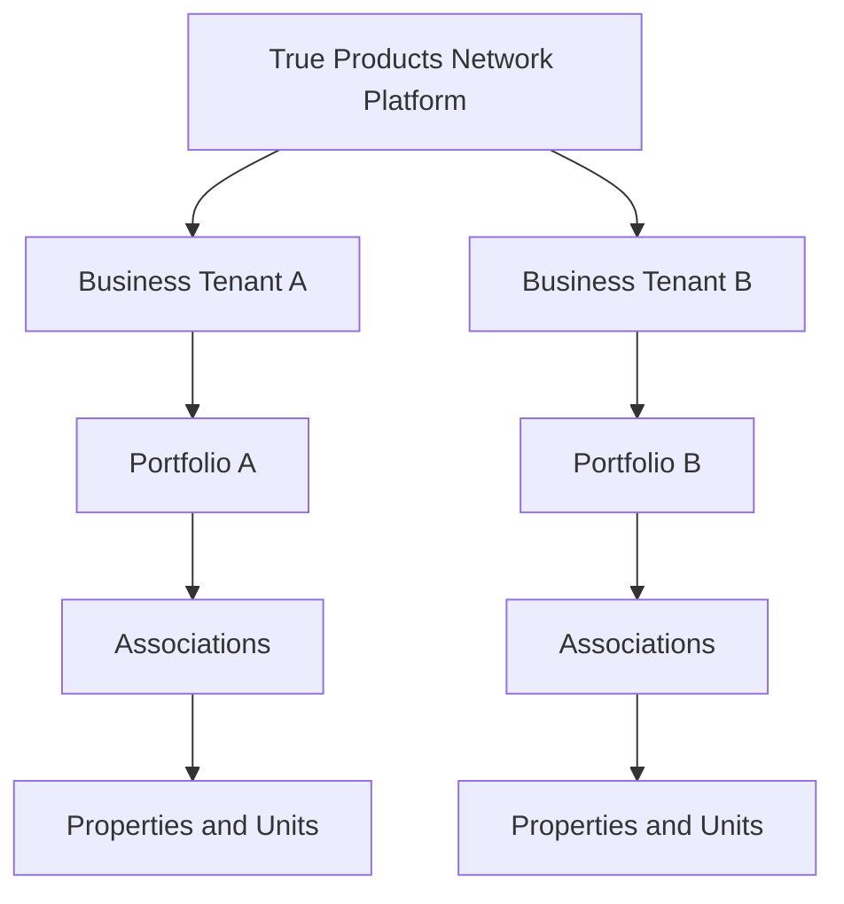

# Associos Property Management Portal

## Multi-Tenant Platform Architecture Amendment

Document type: Controlling architecture amendment  
Applies to: Associos Property Management Portal and all future subscribing businesses  
Platform owner and operator: True Products Network LLC  
Version: 1.1  
Effective date: August 2, 2026  
Primary time zone: America/Chicago

---

## 1. Purpose

This amendment changes the project from a portal designed for one property-management business into a software platform that True Products Network LLC owns and operates for many subscribing businesses.

The platform will use:

- one maintained application;
- one shared, securely partitioned multi-tenant database by default;
- one tenant account for each subscribing business;
- one or more Portfolios inside each tenant;
- Associations, Properties, Units, People, and operational records inside the correct Portfolio and tenant;
- configurable plans, features, add-ons, limits, and tenant settings;
- an Association-level connection to the approved GHL account/location used for that Association's Contacts, workflows, messages, and tasks;
- Association-level connections to financial systems, which may differ from one Association to another; and
- a separate True Products Network GHL billing system for each subscribing business's Associos subscription.

The current working portal must not be discarded or restarted. It becomes the Associos tenant-facing application used by each subscribing business.

## 2. Authority and document order

When project instructions conflict, use this order:

1. The latest written instruction approved by Nigel Lear for this project.
2. This Multi-Tenant Platform Architecture Amendment.
3. `Emma_Property_Management_Portal_Final_Hybrid_Blueprint.md`.
4. `Emma_Property_Management_Portal_Complete_Build_Specification.md` for detailed tenant-facing screen behavior.
5. Approved screen-reference images.
6. `OpenClaw_Portal_Build_Prompt.md` for the development and testing process.
7. Confirmed database migrations, GHL inventory, and field mappings.

This amendment overrides any earlier statement that assumes:

- Exemplary Services LLC is the only business using the system;
- the product is named Exemplary Property Management Portal rather than Associos Property Management Portal;
- `Admin User` automatically means a True Products Network Platform Admin;
- every customer receives a separate application deployment or codebase;
- all customers receive every feature;
- a fixed historic screen count defines or limits the current application;
- a Business/Tenant or Portfolio is the operational GHL synchronization boundary; or
- a Portfolio owns bank accounts, payment accounts, or an Association's financial ledger.

All hybrid-architecture decisions remain in force unless this amendment changes them. The Portal Database remains authoritative for property-management data, relationships, permissions, forms, and portal activity. GHL remains the contact, workflow, email/SMS, task, and communication-activity layer.

The existing filenames beginning with `Emma_` may remain temporarily to avoid breaking repository references. They are legacy filenames only; the product and user-facing portal name is **Associos Property Management Portal**.

## 3. Platform ownership and operating model

True Products Network LLC owns and runs the platform.

For product and technical purposes, this means True Products Network controls:

- the application source code and releases;
- the shared database design and migrations;
- the platform infrastructure and system configuration;
- the plan and feature catalog;
- tenant provisioning, suspension, reactivation, and closure procedures;
- platform-level security, monitoring, backups, and audit controls;
- shared integrations, templates, workflow packages, and deployment standards; and
- Platform Admin access.

Each subscribing business receives a licensed, private business account within the platform. A subscription does not transfer ownership of the software or platform to that business.

Each business may access only its authorized account, users, Portfolios, Associations, Properties, Units, files, activity, and related operational records. True Products Network support access must be controlled, time-bound where practical, and recorded in the platform audit log.

This is an architecture document, not the customer contract. Customer-data rights, retention, export, deletion, privacy, service levels, and licensing terms must also be stated in the applicable service agreement and privacy terms.

## 4. Governing platform structure



### 4.1 Required hierarchy

| Level | Meaning | Ownership and scope rule |
|---|---|---|
| Platform | The complete service owned and operated by True Products Network | Contains all tenants; visible only to authorized True Products Network platform personnel |
| Tenant / Business Account | One subscribing property-management business | Hard security boundary for its users and data |
| Portfolio | A manageable collection of Associations within one tenant | Organizes Associations and provides consolidated reporting; it has no bank accounts, payment accounts, or financial ledger |
| Association | One HOA, condominium association, community, or other managed Association | Belongs to exactly one Portfolio and one tenant; owns its operational GHL mapping and financial-system configuration |
| Property | A building, parcel, development, or managed address | Belongs to exactly one Association under the current product model |
| Unit | A unit, lot, or home within a Property | Belongs to exactly one Property |
| Related records | People, maintenance, inspections, documents, compliance, vendors, approvals, messages, and payment references | Must resolve to one tenant and an authorized business scope |

### 4.2 Provisioning rather than separate installation

When a new business purchases the platform, True Products Network provisions a tenant account. This process must:

1. Create the tenant record and unique tenant code.
2. Create its default Portfolio.
3. Assign the purchased plan and effective subscription dates.
4. Apply the plan's default features, limits, and settings.
5. Apply approved add-ons or tenant-specific overrides.
6. Create or invite the first Business Admin.
7. Create the business's subscription-customer mapping in True Products Network's separate GHL billing system.
8. Configure branding, time zone, contact settings, and approved business parameters.
9. Record the provisioning action in the platform audit log.

Operational GHL and financial-system connections are configured when each Association is created or onboarded. They are not attached to the Tenant or Portfolio record.

This is called tenant provisioning. It is not a separate copy of the product.

## 5. Multi-tenant database model

### 5.1 Standard deployment

The standard product uses one PostgreSQL-compatible database with a shared schema. Tenant data is partitioned logically and protected using `tenant_id`, authorization policies, database constraints, and application checks.

Do not create one ordinary database per subscribing business. A dedicated database may later be sold as an Enterprise option when a customer has a contractual isolation requirement, special backup policy, unusually high volume, or an approved custom integration.

### 5.2 Canonical tenant key

`tenant_id` is the canonical security-partition key.

The Final Hybrid Blueprint currently uses `organization_id` for the management-company boundary. OpenClaw must treat that field as the tenant boundary and use one of these approaches:

- If the database has not been created, use `tenant_id` as the physical column name.
- If `organization_id` already exists in working code or migrations, retain it temporarily or permanently as the physical column, document that it means `tenant_id`, and do not create both columns on the same record.

There must be one canonical tenant key in code. Do not maintain separate `organization_id` and `tenant_id` values that could disagree.

### 5.3 Tenant key rules

Every tenant-owned table must contain the canonical tenant key, including relationship, file, audit, workflow, outbox, webhook, search-index, and cached-summary tables.

The tenant key must:

- be assigned by trusted server-side code, never accepted from an ordinary browser form;
- be included in all tenant-scoped unique constraints and important indexes;
- be immutable through ordinary user actions;
- match the tenant key of every parent and related record;
- be carried through background jobs, integration events, reports, exports, and file operations;
- be checked before reading, creating, changing, linking, exporting, or archiving data; and
- be present in audit events.

The tenant key is intentionally stored on tenant-owned records as the security boundary. This does not change the rule that Maintenance reaches Association through Property. Do not add a duplicate `association_id` to Maintenance Request.

### 5.4 Required platform and tenant tables

| Table | Purpose |
|---|---|
| `tenants` | Subscribing business account, status, name, code, branding reference, locale, and time zone |
| `tenant_subscriptions` | Current and historical plan assignment, status, billing reference, effective dates, cancellation date, and grace period |
| `plans` | Configurable product tiers |
| `features` | Stable feature catalog and feature codes |
| `plan_features` | Default entitlement and limit for each feature on each plan |
| `tenant_entitlements` | Approved add-ons, exceptions, trials, or overrides with dates and reason |
| `tenant_limits` | Resolved limits where a separate limit record is needed |
| `tenant_usage` | Metered usage by tenant, feature, and period |
| `tenant_settings` | Configurable business settings that do not grant an unpurchased feature |
| `portfolios` | One or more Portfolios belonging to a tenant |
| `portfolio_user_assignments` | Users and Portfolio Manager assignments |
| `tenant_users` | User membership and status inside a tenant |
| `role_assignments` | Tenant, Portfolio, Association, Property, Unit, or Vendor-scoped roles |
| `association_ghl_connections` | Association-to-GHL-location mapping and non-secret operational configuration |
| `association_financial_connections` | Association-level mapping to its approved financial system; secrets remain outside ordinary records |
| `tenant_billing_customers` | Business subscription-customer reference in True Products Network's separate GHL billing system |
| `support_access_sessions` | Approved True Products Network support access, reason, dates, and actor |
| `platform_audit_events` | Immutable platform-level administrative history |

All existing business tables in the Final Hybrid Blueprint remain required and become tenant-owned tables.

### 5.5 Relationship rules

The controlling relationship path is:

```text
Tenant
└── Portfolio
    └── Association
        └── Property
            └── Unit
```

Operational records follow their approved direct parent relationships. Examples:

```text
Maintenance Request → Property → Association → Portfolio → Tenant
Inspection → Property → Association → Portfolio → Tenant
Compliance Matter → Property → Association → Portfolio → Tenant
```

Contacts and Vendors may participate in several Associations or Portfolios inside the same tenant through relationship tables. A cross-tenant relationship is prohibited.

An Association cannot belong to more than one tenant. Moving an Association between tenants is a protected Platform Admin migration, not an ordinary edit.

## 6. Data-isolation requirements

Tenant isolation is required at every layer. Hiding another tenant's records in the interface is not sufficient.

### 6.1 Required controls

- Establish the active tenant from the authenticated session and verified tenant membership.
- Apply database row-level security where supported.
- Require `tenant_id` in repository/service queries and deny unscoped data-access methods in tenant-facing code.
- Use composite foreign keys, constraints, or equivalent checks to prevent cross-tenant relationships.
- Scope search indexes, cache keys, queues, exports, analytics, and report files by tenant.
- Store files beneath tenant-scoped storage paths and authorize every download.
- Include tenant context in every background job and integration event.
- Do not reveal whether another tenant's record exists. Return an ordinary not-found or access-denied result.
- Redact secrets and sensitive data from logs.
- Record platform support access and privileged cross-tenant actions.

### 6.2 Platform Admin access

A Platform Admin may select a tenant for support or administration, but the interface must always show the active tenant prominently. Any action taken while viewing a tenant must record:

- Platform Admin identity;
- tenant;
- support reason or administrative purpose;
- action;
- target record;
- timestamp; and
- before-and-after values where appropriate.

The platform must not provide an unlogged universal impersonation mode.

## 7. Roles and scopes

Platform roles and tenant roles are separate.

| Role | Assigned by | Scope | Main responsibility |
|---|---|---|---|
| Platform Admin | True Products Network | Entire platform | Provision tenants, assign plans, manage features, integrations, platform settings, and audited support access |
| Platform Support | True Products Network | Approved tenant support session | Diagnose customer issues with the minimum required access |
| Business Admin | Platform Admin or authorized Business Admin | One tenant | Manage business users, business settings, and all permitted Portfolios within the tenant |
| Portfolio Manager | Business Admin | One or more Portfolios | Control the Association list and staff assignments for assigned Portfolios |
| Property Manager | Business Admin or Portfolio Manager | Assigned Associations or Properties | Operate assigned records and processes |
| Association Manager | Business Admin or Portfolio Manager | One or more Associations | Work only within assigned Associations |
| Bookkeeper / Finance Restricted | Business Admin | Assigned Portfolio or Associations | View permitted financial handoff and payment-status information |
| Board Member | Authorized tenant staff | Assigned Association | Board views, approvals, meetings, and permitted records |
| Owner | Authorized tenant staff | Related Association, Property, and Unit | Owner records and permitted self-service functions |
| Resident / Occupant | Authorized tenant staff | Related Unit | Resident records and permitted self-service functions |
| Vendor Contact | Authorized tenant staff | Assigned Vendor and jobs | Quotes, schedules, work updates, documents, invoices, and messages |

The existing blueprint's `Admin User` role becomes `Business Admin` within the tenant-facing portal. It must not grant access to the True Products Network Platform Console.

### 7.1 Portfolio Manager behavior

The Portfolio Manager controls the Managed Associations list for the Portfolios assigned to that manager, subject to the tenant's plan and limits.

A Portfolio Manager may:

- create, edit, archive, and review Associations when permission allows;
- assign Property Managers and Association Managers;
- select an Association as the current working context;
- see Portfolio-wide summaries; and
- move an Association between Portfolios within the same tenant when authorized.

A Portfolio Manager may not:

- see another tenant;
- change the tenant's plan;
- enable an unpurchased feature;
- change platform-wide feature definitions;
- map an Association to a different GHL account/location without an approved administration process; or
- move an Association to another tenant.

## 8. Portfolio and Association experience

After login, the portal resolves the user's tenant membership, Portfolio assignments, Association assignments, and entitlements.

| User access | Required behavior |
|---|---|
| One authorized Association | Select it automatically and open its dashboard |
| Several Associations in one Portfolio | Show the Association selector and Managed Associations list |
| Several authorized Portfolios | Show a Portfolio selector, then the Associations within the selected Portfolio |
| Business Admin | Allow an authorized All Portfolios summary for that tenant only |
| Platform Admin | Use the separate Platform Console; enter a tenant through an audited support/admin context |
| Board, Owner, Resident, or Vendor | Do not show a broad Association directory; show only assigned or related records |

Selecting an Association establishes the working context for Properties, Units, People, Maintenance, Inspections, Documents, Compliance, Vendors, Board records, Communications, approvals, payment references, reports, and activity.

The server must verify tenant, Portfolio, Association, role, and feature access on every protected request. A selector in the browser is not an authorization control.

## 9. Plans, features, add-ons, and limits

The product uses one codebase with configurable entitlements. Do not create Basic, Growth, Premium, or Enterprise branches of the application.

Plan names and prices are business configuration, not hard-coded application logic. `Basic`, `Growth`, `Premium`, and `Enterprise` may be used as seed examples until Nigel approves the commercial plan names and contents.

### 9.1 Feature catalog

Every controlled feature needs a stable code, for example:

```text
core.associations
core.properties
core.units
core.people
maintenance.basic
maintenance.advanced
documents.library
inspections
compliance
vendor_portal
board_portal
payments
reports.standard
reports.advanced
ghl.automation.basic
ghl.automation.advanced
branding.custom
portfolios.multiple
```

Feature codes must not be derived from display labels. Display names may change without breaking authorization.

### 9.2 Entitlement resolution

Effective access is calculated from:

1. active tenant subscription;
2. plan defaults;
3. dated tenant add-ons or approved overrides;
4. feature dependencies;
5. tenant limits and current usage;
6. the user's role and record scope; and
7. the record's tenant and relationship scope.

An entitlement answers whether the business purchased access. A role answers whether a user may perform the action. Both checks must pass.

### 9.3 Enforcement

When a feature is not entitled:

- remove it from ordinary navigation;
- block its screens through direct URLs;
- block its API operations;
- stop new related automations and background jobs;
- prevent new usage above the plan limit; and
- show an upgrade or contact-administrator message where appropriate.

The server-side entitlement service is authoritative. Front-end feature flags are for presentation only.

### 9.4 Downgrade and suspension behavior

- Never delete business data automatically because of a downgrade, expired add-on, limit reduction, or temporary suspension.
- Stop new actions for unavailable features according to the plan policy.
- Preserve existing records for reactivation, retention, export, or approved read-only access.
- Pause related tenant automations safely.
- Record the effective change, actor, reason, and previous entitlement state.
- Provide grace-period behavior through subscription configuration rather than hard-coded dates.

### 9.5 Settings do not grant features

`tenant_settings`, Portfolio settings, and Association settings configure behavior only after entitlement is confirmed. A setting must never turn on a feature that the tenant has not purchased.

Settings may include:

- business branding;
- default time zone and locale;
- Portfolio and Association terminology;
- maintenance categories and priorities;
- approval thresholds;
- notification rules;
- response-time targets;
- document and acknowledgment preferences; and
- enabled payment or financial handoff options allowed by the plan.

Precedence is:

```text
Platform safety rule
→ Tenant entitlement
→ Tenant setting
→ Portfolio or Association setting when supported
→ User preference when supported
```

## 10. Association integration structure

The Portal Database remains the authoritative system. GHL receives controlled contact and event projections.

### 10.1 Operational GHL mapping

The operational mapping is resolved from the Association:

```text
Association → Approved GHL Account / Sub-account / Location
```

The Association remains an authoritative record in the Associos Portal Database and is visible in the customer-facing system. `association_ghl_connections` stores the non-secret mapping required to send that Association's Contact projections and events to the correct GHL destination.

Integration workers must resolve the destination from a verified `association_id` after checking the authenticated Tenant and relationship path. They must never select a GHL location from a browser-supplied location ID. When an event originates from a Property, Unit, Maintenance Request, Inspection, Document, Compliance Matter, Person relationship, or other operational record, the worker derives the Association through the authoritative Portal Database relationships and then resolves the Association's GHL connection.

Each Association may map to its own GHL location. More than one Association may share a location only when that arrangement is deliberately configured and does not weaken Association-level data separation, workflows, permissions, or reporting.

The GHL integration must preserve each Association's context for:

- Contacts;
- workflows;
- email and SMS activity;
- tasks;
- conversations;
- phone numbers;
- sending domains; and
- calendars when included.

GHL credentials and webhook secrets belong in an approved secret manager. Do not store raw secrets in `association_ghl_connections`, browser code, source control, ordinary logs, or tenant-visible settings.

No Tenant-level or Portfolio-level mapping may be used as a substitute for the Association mapping. A Tenant may have many Associations connected to different GHL locations.

Every operational integration event must include the internal Tenant and Association context, event type, portal record ID, idempotency key, and correlation ID. A GHL failure must remain in the retryable Tenant- and Association-scoped integration queue and must not invalidate a successful Portal Database transaction.

### 10.2 Association financial-system mapping

Each Association may use a different financial or accounting system. Its connection, external account reference, import schedule, data permissions, and reporting status belong to that Association.

Associos may read or receive approved financial summaries and transaction-status data from those Association systems. The financial system remains the source of truth for the Association's ledger, balances, bank reconciliation, and official financial statements.

The Portfolio may consolidate and report authorized financial data from its Associations. It does not own bank accounts, hold funds, process Association payments, keep a Portfolio ledger, or become the source of truth for the underlying Association transactions.

## 11. Screen and navigation changes

### 11.1 Existing tenant-facing screens

All existing and approved tenant-facing screens remain part of the application. They must be Tenant-scoped and entitlement-aware. The working application and later decisions may contain more screens than earlier documents. OpenClaw must inventory the current routes and screen registry and must not use any historic number as a scope ceiling.

Apply these terminology and behavior changes:

- `Admin User` in the tenant portal means `Business Admin`.
- `MG-01 — Portfolio Overview` shows the active Portfolio or an authorized tenant-wide summary.
- `MG-02 — Association List` is labeled `Managed Associations`.
- `MG-03 — Association Detail` remains the connected Association record view.
- The header shows the active business, Portfolio when applicable, and Association when applicable.
- Navigation, routes, actions, widgets, reports, and workflows respect both role permissions and tenant entitlements.
- Search is always tenant-scoped before Portfolio, Association, Property, or role filters are applied.

### 11.2 True Products Network Platform Console

The Platform Console is separate from the existing tenant-facing screens and must use a separate route boundary and Platform Admin authorization policy.

| ID | Platform screen | Purpose |
|---|---|---|
| `PL-01` | Platform Dashboard | Tenants, subscription status, alerts, integration health, and usage summary |
| `PL-02` | Business Accounts | Searchable tenant list with status, plan, usage, and support alerts |
| `PL-03` | Business Account Detail | Tenant profile, Portfolios, plan, features, limits, integrations, users, and activity |
| `PL-04` | Provision / Edit Business Account | Create, configure, suspend, reactivate, or schedule closure of a tenant |
| `PL-05` | Plans | Create and version plan definitions without changing historical subscriptions |
| `PL-06` | Feature Catalog | Manage stable features, dependencies, display information, and availability |
| `PL-07` | Entitlements and Add-ons | Assign dated tenant overrides, add-ons, trials, and approved exceptions |
| `PL-08` | Usage and Limits | Review tenant usage, plan limits, warnings, and blocked actions |
| `PL-09` | Platform Users and Support Access | Manage True Products Network personnel and audited support sessions |
| `PL-10` | Association Integrations | Review Association-level GHL and financial-system mappings and non-secret integration status |
| `PL-11` | Platform Audit Log | Review tenant provisioning, plan, entitlement, support, and platform changes |
| `PL-12` | Platform Health and Error Queue | Review tenant-scoped jobs, webhooks, sync errors, retries, and service status |

These Platform Console screens are additions to the existing tenant-facing application. They do not establish a final total. Reusable layouts and components are still required, and the maintained route/screen inventory is the source of truth for the current count.

### 11.3 Tenant administration additions

The tenant-facing Business Admin experience must also provide, through existing Admin layouts or reusable subroutes:

- Business settings;
- Portfolio list and Portfolio detail;
- tenant user and role management;
- Portfolio, Association, and Property staff assignments;
- current plan and enabled-feature readout;
- current limits and usage readout; and
- upgrade/contact True Products Network actions.

Business Admin users may view their plan and request changes. They may not edit plan definitions or grant their tenant an unpurchased feature.

## 12. Business subscriptions and Association finances are separate

Do not mix True Products Network's Associos subscription billing with an Association's resident, owner, vendor, or property-management payment activity.

- `tenant_subscriptions` governs the business's access to the platform.
- The subscribing business pays True Products Network LLC through a separate True Products Network GHL billing system.
- A verified billing callback updates the business's subscription transaction reference and status in `tenant_subscriptions`.
- The completed, failed, refunded, disputed, or cancelled billing event may be displayed to authorized Business or Portfolio administrators, but it is not Portfolio financial data.
- Association payment and financial activity remains in each Association's approved financial system and is connected through `association_financial_connections`.
- Portfolio financial views are consolidated reports from Association data only. A Portfolio has no bank account, payment account, holding account, or formal ledger.
- A tenant's subscription payment status may change platform access according to the approved grace and suspension rules.
- Subscription records must never appear in Owner/Resident, Board, or Vendor financial screens.
- Association funds must never be routed through the operational GHL connection merely because GHL is connected for messages and workflows.

The True Products Network billing GHL connection and every Association's operational GHL connection are separate integration contexts, even when they use the same GHL agency infrastructure.

Until subscription billing is automated, a Platform Admin may assign and change plans manually with an audit reason and effective date.

## 13. Migration of the work already completed

OpenClaw must continue the existing project and correct the foundation in controlled steps.

1. Commit or otherwise preserve the current working state.
2. Audit current tables, authorization, routes, queries, jobs, files, caches, and GHL integration for single-business assumptions.
3. Add the tenant, plan, feature, entitlement, Portfolio, and platform-role models.
4. Provision Exemplary Services LLC as the first Associos tenant.
5. Create its default Portfolio and attach its existing Associations.
6. Backfill the canonical tenant key on all existing tenant-owned records.
7. Add same-tenant constraints, indexes, and row-level policies.
8. Update sessions and server services to establish verified tenant context.
9. Update search, files, reports, exports, queues, audit events, and integration events to require tenant context.
10. Add the entitlement service and apply it to navigation, routes, APIs, jobs, and limits.
11. Change the tenant `Admin User` meaning to `Business Admin` without granting platform access.
12. Add Portfolio Manager and related scoped assignments.
13. Add the Platform Console behind separate Platform Admin authorization.
14. Replace any Tenant- or Portfolio-level operational GHL mapping with Association-level mappings without losing existing connection data.
15. Configure the Exemplary Services LLC subscription-customer reference in True Products Network's separate GHL billing system.
16. Add Association-level financial-system mappings and keep Portfolio financial views reporting-only.
17. Run all isolation, entitlement, relationship, workflow, finance-boundary, and regression tests before continuing feature expansion.

Do not delete matching screens or working business logic. Do not create a second competing tenant key. Do not move production data until the migration and rollback plan has been reviewed.

## 14. Required acceptance tests

### 14.1 Tenant isolation

- A user from Tenant A cannot list, search, open, update, link, export, or download any Tenant B record.
- Changing a tenant, Portfolio, Association, record, file, or GHL identifier in a URL or request does not bypass authorization.
- Database policies block a cross-tenant query even if application code omits a filter.
- Cross-tenant foreign-key and relationship attempts fail.
- Search, autocomplete, counts, dashboard totals, reports, caches, jobs, files, and audit views remain tenant-scoped.
- Platform support access is authorized, visibly scoped, and audited.

### 14.2 Plans and features

- A feature enabled by the plan is available only to users whose roles also permit it.
- A hidden feature cannot be opened by direct URL or API call.
- An add-on activates and expires according to its effective dates.
- A limit blocks only the affected new action and does not delete existing records.
- A downgrade preserves data and pauses unavailable automation safely.
- Tenant settings cannot enable an unpurchased feature.
- Plan and feature display-label changes do not break stable feature codes.

### 14.3 Portfolio and Association scope

- A Business Admin sees only the tenant's Portfolios.
- A Portfolio Manager sees only assigned Portfolios and controls only their Managed Associations.
- Selecting an Association populates only its authorized related records.
- Maintenance reaches Association through Property and has no duplicate Association relationship.
- Owners, residents, board members, and vendors do not gain a broad Association directory.

### 14.4 GHL and financial integration

- An Association's operational events can reach only that Association's approved GHL destination.
- An event derived from a Property or other child record resolves the Association through authoritative database relationships before selecting GHL.
- A Tenant- or Portfolio-level GHL identifier cannot override the Association mapping.
- Browser-supplied GHL location IDs are rejected or ignored.
- Integration failures remain Tenant- and Association-scoped and retryable.
- Idempotent retries do not create duplicate GHL Contacts, tasks, messages, or workflow events.
- Disabling a GHL-related entitlement stops new disallowed events without damaging Portal Database records.
- Two Associations in the same Portfolio may use different financial systems without mixing their data or credentials.
- Portfolio reports consolidate authorized Association financial data without creating a Portfolio bank account or ledger.
- True Products Network subscription billing callbacks update only the business subscription record and never an Association ledger.

## 15. Developer decision rule

If a proposed design makes it possible for one subscribing business to see another business, allows a tenant administrator to grant unpurchased features, or requires a separate codebase for an ordinary customer, it conflicts with this amendment.

The controlling product decision is:

> True Products Network LLC owns and operates the Associos Property Management Portal. Each subscribing business receives a securely separated Tenant account with one or more Portfolios. Portfolio Managers control the Associations assigned to their Portfolios. Each Association owns its operational GHL mapping and financial-system configuration. Portfolios consolidate Association reporting but hold no bank accounts or financial ledger. Plans, add-ons, limits, Tenant settings, and user roles determine access. The Portal Database is authoritative. Business subscriptions are billed through True Products Network's separate GHL billing system.

## 16. Required OpenClaw response before implementation

After reading this amendment, OpenClaw must first provide an impact assessment containing:

- current single-tenant assumptions found in code and schema;
- code and screens that can remain unchanged;
- database migrations and backfill approach;
- tenant-isolation policy design;
- Portfolio and role changes;
- plan and entitlement design;
- Platform Console route and authorization plan;
- existing-route and screen inventory without a fixed historic count;
- Association-level GHL connection changes;
- Association financial-system mappings and Portfolio reporting boundaries;
- True Products Network subscription-billing callback design;
- test and rollback plan;
- risks and unresolved decisions; and
- recommended implementation order.

OpenClaw must stop after the assessment and wait for approval before running production migrations, moving data, changing live GHL connections, or implementing destructive changes.
